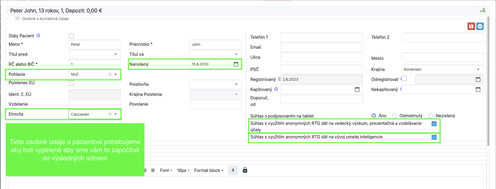
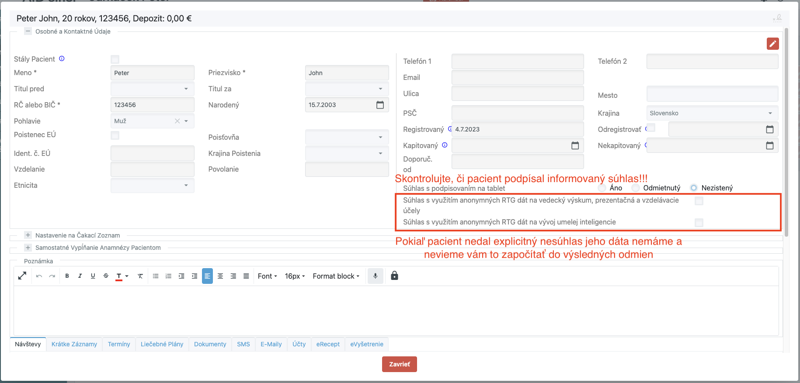
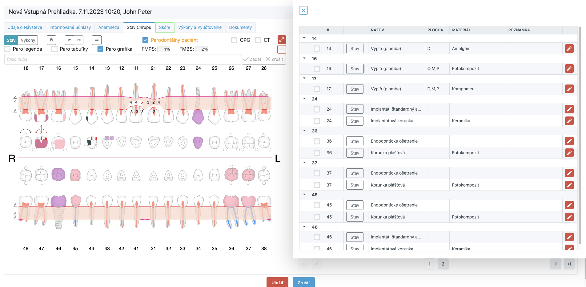
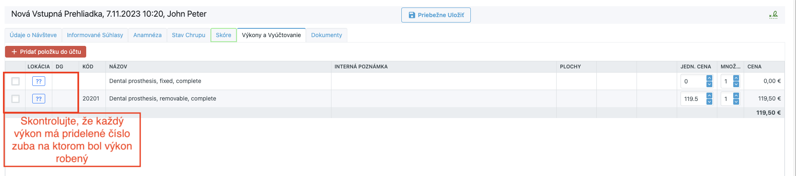
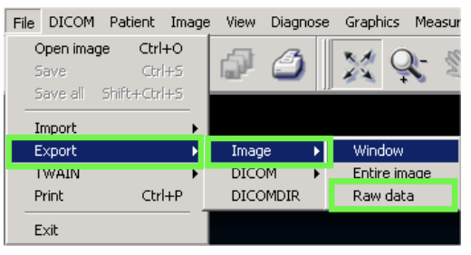
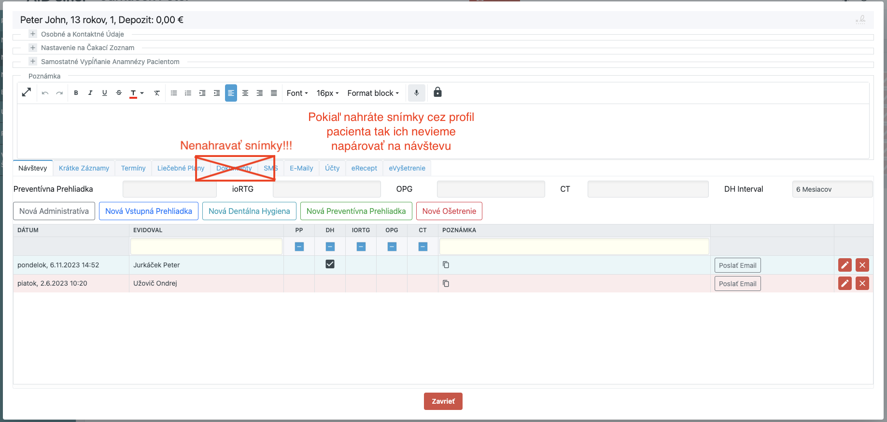
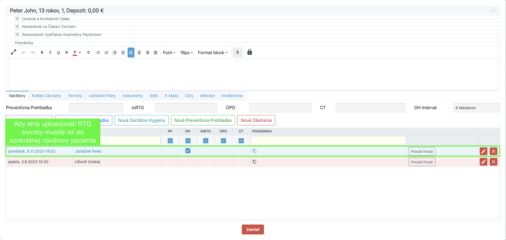
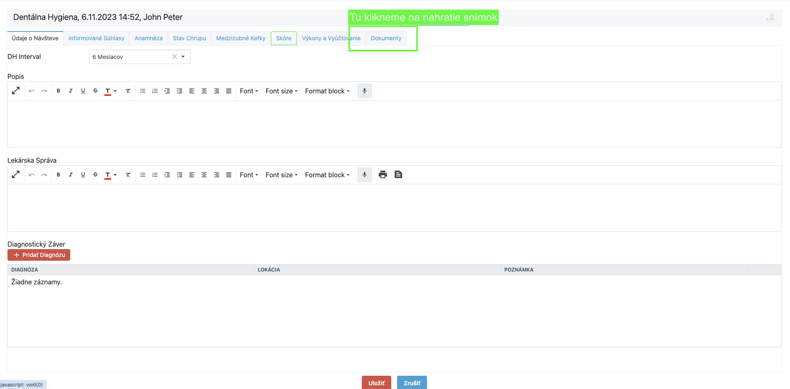
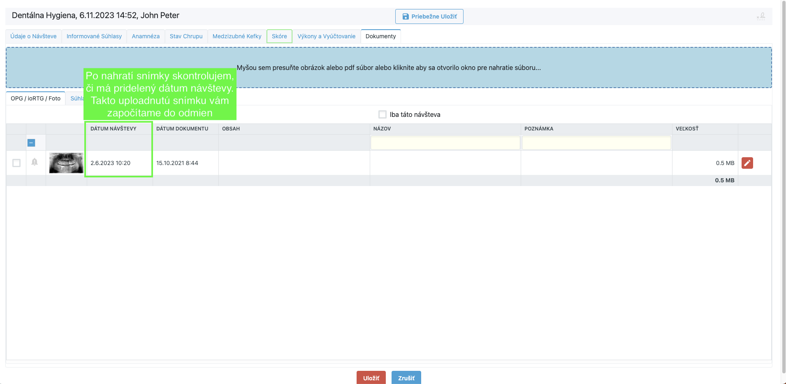

# Semafor - Zber dát pre AI

V tejto príručke sme popísali čo by sme od vás potrebovali na zbieranie konzistentných dát z vašej kliniky s ktorou spolupracujeme.

## Čo od vás potrebujeme?

### Zaregistrovanie pacienta (Recepcia)

1. Vytvorenie karty pacienta v systéme ak neexistuje
2. Podpísanie informovaných súhlasov s pacientom
3. Zaškrtnutie dvoch polí v semafore v **“Karte pacienta”**

### Zaevidovanie návštevy pacienta v deň výkonu (Doktor/Sestrička)

1. Skontrolovanie osobných údajov a podpísanie informovaných súhlasov v karte pacienta
2. Vybratie výkonu na ktorý sa pacient dostavil
    1. **Nová Vstupná Prehliadka**
    2. **Nová Dentálna Hygiena**
    3. **Nová Preventívna Prehliadka**
    4. **Nové Ošetrenie**
3. Zaznačenie stavu chrupu do semafóru
4. Zaznačenie urobených výkonov do semafóru
5. Nahratie pacientovych RTG snímok do semafóru

***Poznámka:** Potrebujeme aby ste do záznamu o návšteve pacienta nahrali stav chrupu, výkony, ktoré boli na návšteve urobené a RTG snímky, ktoré boli počas návštevy vytvorené. Export snímok a prosím robte v rovnakom dni v akom boli vytvorené*

## Používateľská príručka práce so Semafórom

### Skontrolovanie osobných údajov a informovaných súhlasov pacienta

V karte pacienta v časti **“Osobné a Kontaktné Údaje”** prosím vyplňte všetkých 5 zelených polí o pacientovi: **Pohlavie, Etnicita, Narodený, 2xSúhlas**

Note: Pokiaľ pacient nepodpísal informované súhlasy na vývoj umelej inteligencie a na vzdelávacie účely tak dáta o pacientovi sa k nám neodošlú

### Zaznačenie stavu chrupu do semafóru

Potrebujeme aby ste do návštevy pacienta zapísali všetky patológie (napr. kaz atď.), ktoré sú viditelné na RTG pacienta. 

### Zaznačenie urobených výkonov do semafóru

Skontrolujte, že všetky zákroky, ktoré boli robené na návšteve pacienta sa nachádzajú vo výkonoch a **majú priradené konkrétne čísla zubov**

### Nesprávne
Note: Skontrolujte, že každý výkon ma pridelné číslo zuba na ktorom bol výkon robený

### Správne

Note: Skontrolujte, že pri výkone pacienta je vyplnená Lokácia a DG

### Export ****RTG snímok pacienta**

Snímky prosím exportujte vo formáte **PNG**. Skontrolujte, že súbor má v názve “**.png**”. Odporúčame vám snímky vyexportovať do priečinka, ktorý nazvete napríklad menom pacienta aby ste mali poriadok v dátach, ktoré ste vyexportovali. Príklad exportu Z CliniView sme znázornili nižšie.

- Súbor → Export → Image → Raw Data → .png

***Poznámka:** Snímky prosím exportujte vo formáte .png a nie .jpg. Je to preto lebo jpg je stratový formát a môžeme prísť o doležité detaily na obrázku.*

- ***Otázka**: Ktoré všetky snímky mám **uploadovať do semafóru?***
    - *Len také snímky, ktoré boli urobené počas danej návštevy ku ktorej snímky nahrávate*
    - *V prípade ak neboli počas danej návštevy urobené RTG nemusíte žiadne snímky nahrávať a je potrebné iba vyplniť “Stav chrupu” ak sa tam niečo zmenilo a “Výkony”, ktoré boli na návšteve urobené.*
- ***Otázka**: Kde nájdem snímky pacienta?*
    - *Snímky by mali byť v softvéri, ktorý ste použili na ich vytvorenie. Takže napríklad NewTom alebo CliniView*
    - *Snímky by mali byť v softvéri, ktorý ste použili na ich vytvorenie. Takže napríklad NewTom alebo CliniView*

### Nahratie RTG snímok pacienta do semafóru

- Prosím pri uplodovaní snímok dbajte na to aby ste ich nahrávali pre konkrétnu návštevu pacienta. Vďaka tomu vieme ku konkrétnej snímke napárovat aj vyplnený zubný kríž. V prípade ak pacient priniesol vlastné snímky kľudne ich nahrajte do semafóra do záložky **“Dokumenty”** na karte pacienta ale nie pre konkrétnu návštevu.

### Nesprávny postup

- Prosím pri uploadne snímok dbajte na to aby ste ich nahrávali pre konkrétnu návštevu pacienta a nie cez profil pacienta. Ak nahráte snímku cez profil pacienta nebudeme schopní ju napárovať ku konkrétnej návšteve a nezapočítame vám takúto snímku do odmeny

    

### Správny postup

- Klikneme na návštevu pacienta → Napr. “pondelok 6.11.2023 o 14:52”

- Klikneme na Tab “Dokumenty” v detaile návštevy

- Teraz môžete nahrávať snímky. Aby ste si boli istý, že snímka bola priradená ku konkrétnej návšteve skontrolujte prosím či má pridelený “DÁTUM NÁVŠTEVY”.

