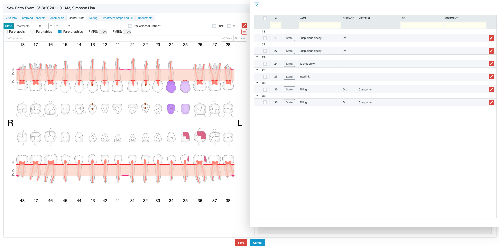

# Semafor - Data Collection for AI

In this guide, we are describing what we need from you to collect consistent data from your clinics.

## What Do We Need from You?

### Patient Registration (Reception)

1. Creating a patient card in the system if it doesn't exist already.
2. Signing informed consents with the patient.
3. Checking two boxes in the **"Patient Card"** semafor.

### Recording Patient Visit on the Day of Procedure (Doctor/Nurse)

1. Verifying personal information and signing informed consents in the patient card.
2. Selecting the procedure for which the patient has arrived:
    1. **New New Entry Exam**
    2. **New Dental Hygiene**
    3. **New Preventive Exam**
    4. **New Treatment**
3. Annotate the dental state on the semafor.
4. Annotate the performed procedures on the semafor.
5. Uploading patient's X-ray images to the semafor.

***Note:** We need you to record the dental state, procedures performed during the visit, and X-ray images created during the visit in the patient's visit record. Please export images on the same day they were created.*

## User Guide for Working with Semafor

### Verifying Patient's Personal Information and Informed Consents

In the patient card under **"Personal and Contact Information,"** please fill in all 5 green fields about the patient: **Sex, Ethnicity, Brithday, 2xConsent**.

*Note: If the patient has not signed informed consents for the development of artificial intelligence and for educational purposes, the patient's data will not be sent to us.*

### Annotating the Dental State on the Semafor

We need you to record all pathologies (e.g., cavities, etc.) visible in the patient's X-ray.

### Annotating the Performed Procedures on the Semafor

Ensure that all procedures performed during the patient's visit are listed in the procedures and **have specific tooth numbers assigned**.

**Incorrect:** The procedures are missing Location where the procedure was performed.*

**Correct:** Check that the location and diagnosis are filled in for the patient's procedure.*

### Exporting **Patient's X-ray Images**

Please export images in **PNG** format. Ensure that the file has ".png" in the name. We recommend exporting images to a folder named after the patient for better organization. An example of exporting from CliniView is shown below.

- File → Export → Image → Raw Data → .png

*Note: Please export images in .png format, not .jpg. This is because jpg is a lossy format and we may lose important details in the image.*

- ***Question:** Which images should I **upload to the semafor?***
    - *Only images taken during the specific visit to which you're uploading images.*
    - *If no X-rays were taken during the visit, you don't need to upload any images; just fill out the "Dental State" if there are changes and the "Procedures" performed during the visit.*
- ***Question:** Where can I find the patient's images?*
    - *Images should be in the software you used to create them, such as NewTom or CliniView or something else.*

### Uploading Patient's X-ray Images to the Semafor

- Please ensure that you upload images for a specific patient visit. This allows us to match each image to the corresponding visit. If the patient brings their own images, feel free to upload them to the **"Documents"** tab on the patient's card but not for a specific visit.

**Incorrect:** Please ensure that you upload images for a specific patient visit, not through the patient's profile. If you upload an image through the patient's profile, we won't be able to match it to a specific visit, and we won't count such an image for the reward.

**Correct:** Click on the patient's visit → e.g., "Monday 6.11.2023 at 14:52"

- Click on the "Documents" tab in the visit detail.

- Now you can upload images. To ensure that the image is assigned to a specific visit, please check if the "VISIT DATE" is assigned.

