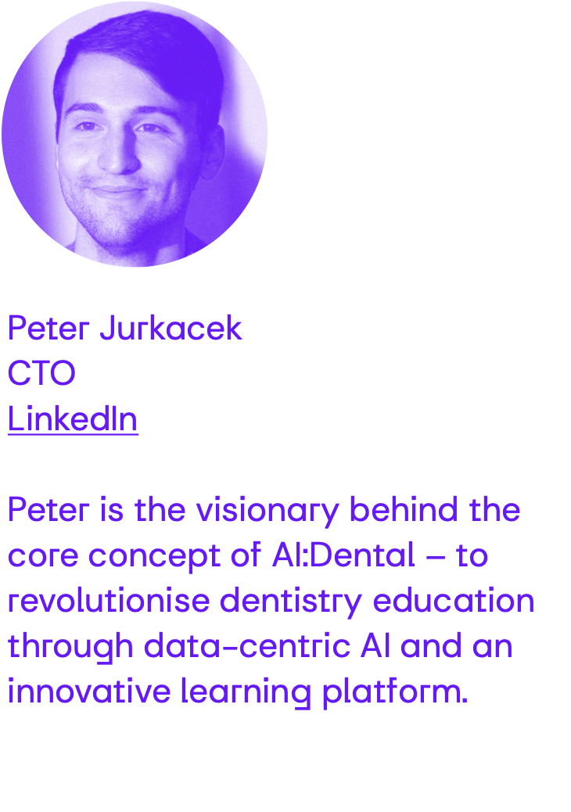

# Unlocking the Future of Dentistry 
## Exploring AI in X-Ray Interpretation
- Welcome students to the session.
- Brief overview of the agenda.

---

<!-- Understanding AI in Diagnostics -->
# Demystifying AI in Dentistry
## Artificial Intelligence (AI) is the simulation of human intelligence processes by computer systems."

flowchart LR
  B["
"]

---

# HOHO

---

# Advantages of AI in Dentistry
- Improved accuracy and efficiency in diagnosis.
- Reduction of human error and subjectivity.
- Enhanced speed in processing and analyzing large datasets.
- Potential for early detection and prevention of dental issues.

---

# Hands-On Training with Our Education Platform
- Introduction to the education platform for dataset preparation.
- Demonstration of platform features and functionalities.
- Instructions for students to prepare annotated datasets.

---

<!-- - Title: "Training Our AI: From Annotations to Classification" -->
# Training Our Own AI
- Overview of the AI training process.
- Importance of annotated datasets for AI learning.
- Explanation of how the AI learns from annotated data.

---

<!-- Decoding X-Rays: Visual Explanation with Saliency Maps -->
# Visual Explanation with Saliency Maps
- Introduction to saliency maps for image interpretation.
- Demonstration of saliency maps highlighting important features in X-ray images.
- Importance of visual explanations for understanding AI decisions.

---

# Conclusion and Next Steps
- Recap of key points covered in the session.
- Encouragement for students to continue exploring AI in dentistry.
- Next steps for further learning and engagement with the education platform.

---
<!-- - Title: "Engage, Inquire, Explore" -->

# Q&A
- Open the floor for questions and discussion.
- Encourage students to share their thoughts, concerns, and ideas.

---

# 9: Thank You
- Title: "Thank You for Joining Us"
- Express gratitude to the students for their participation.
- Contact information for further inquiries or follow-up.

Note: Each slide should be visually appealing with relevant graphics, images, and minimal text for effective communication. Interactive elements such as demonstrations and real-time examples can enhance engagement and understanding.

<!-- Needed for mermaid, can be anywhere in file except frontmatter -->

# Mermaid
