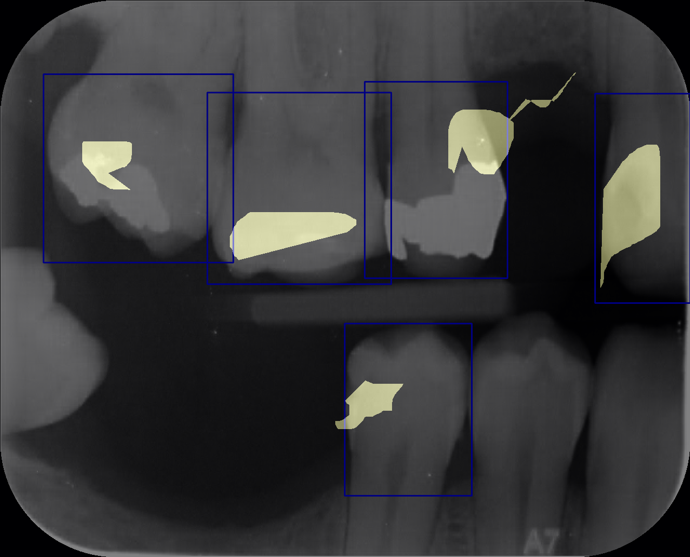

<!-- _paginate: skip -->
# Demystifying **AI** in Dentistry 
Deep dive into exercises for X-Ray diagnostics
<!--
- Welcome students to the session.
- Brief overview of the agenda. 
-->

---

<!-- Understanding AI in Diagnostics -->
# What is **AI**?

*Artificial Intelligence (AI) is the **simulation of human intelligence** processes by computer systems.*

---

### **Human Intelligence** in Dentistry?
# Dental Professional Intelligence
1. Take X-ray
2. Interpret X-ray
3. Make decisions

---

<!-- _footer: "1. 2022 Evaluation of radiographic interpretation skills of undergraduate dental students studying in a dental college of Punjab, India – A comparative study" -->

X-Ray Interpretation
<!--  -->

#
#
#
# Students' Intelligence?
Dental **students' accuracy** in X-Ray interpretation ranges from **48% to 65%**[1]

---

### **Human Intelligence** in Dentistry?
# Dental Professional Intelligence
1. Take X-ray
2. Interpret X-ray
3. Make decisions

---

### **Simulation** of **Human Intelligence** in Dentistry?
# Artificial Intelligence
1. Take X-ray
2. Interpret X-ray
3. Make decisions

---

# How to create Intelligence?
- Task
- Exercise
- Evaluation

---

## Creating Students' Intelligence

# Professor's Perspective
* Task: I would like to teach my **students** how to classify tooth decay from dental X-ray images
* Exercise: I have to design exercises for them
* Evaluation: I have to evaluate their performance

# Student's Perspective
* Task: I would like to know how to classify tooth decay from dental X-ray images
* Exercise: I have to do exercises (e.g., interpret at least 100 X-rays with tooth decay)
* Evaluation: If scored above 90%, I am prepared

---

## Creating Artificial Intelligence

# Data Scientist's Perspective
- Task: I would like to teach my **~~students~~ AIs** how to classify tooth decay from dental X-ray images
- Exercise: I have to design exercises for them
- Evaluation: I have to evaluate their performance

# AI's Perspective
- Task: My task is to know how to classify tooth decay from dental X-ray images
- Exercise: I have to do exercises (e.g., interpret at least 100 X-rays with tooth decay)
- Evaluation: If scored above 90%, I am prepared

---

<!-- - Title: "Training Our AI: From Annotations to Classification" -->
# Let's Create Better Intelligence Together

1) We will get to know each other
2) We will go through our exercises in X-ray interpretation, compare yourself with our experts
3) AI will go through our exercises
4) We will see a comparison between you and our AI

---

# 1. Get to Know Each Other
- Questionnaire

---

# 2. Do Our Exercises
- Quiz
- Tagging per patient
- Catalog of cases

---

# 3. AI Exercises
- AI training pipeline
- Evaluation

---

# 4. Comparison
- AI score
- Your score

