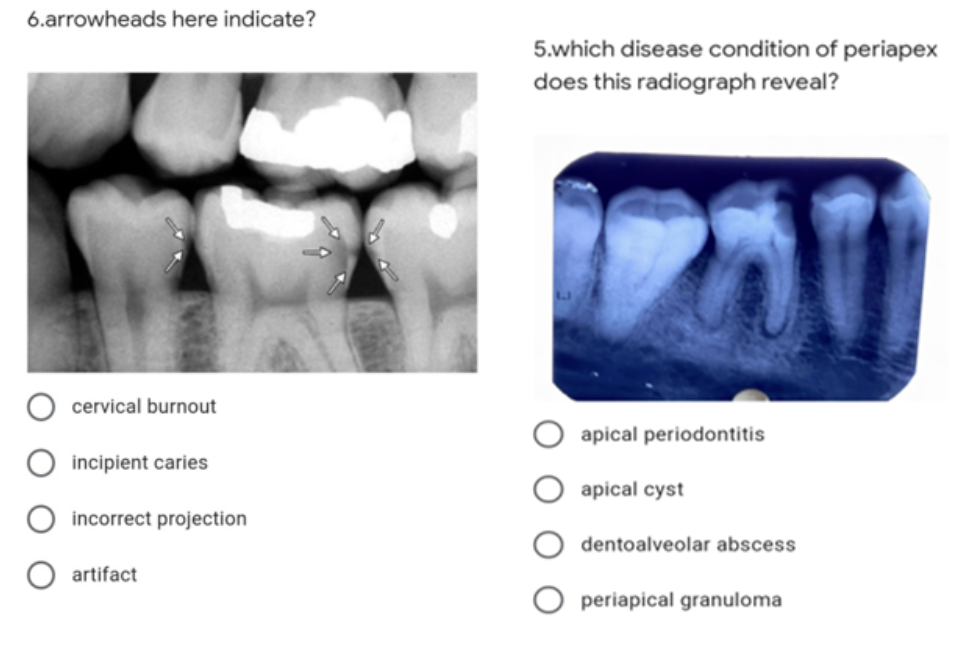

<!-- _paginate: skip -->
# Demystifying **AI** in Dentistry 
Deep dive into excercices for in X-Ray diagnostics
<!--
- Welcome students to the session.
- Brief overview of the agenda. 
-->

---

<!-- Understanding AI in Diagnostics -->
# What is the **AI**?

*Artificial Intelligence (AI) is the **simulation of human intelligence** processes by computer systems.*

---

### **Human Intelligence** in dentistry?
# Dental professional intelligence
1. Take X-ray
2. Interpret X-ray
3. Make decision

---

<!-- _footer: "1. 2022 Evaluation of radiographic interpretation skills of undergraduate dental students studying in a dental college of Punjab, India – A comparative study" -->

X-Rays interpretation
<!--  -->

#
#
#
# Students' intelligence?
Dental **students' accuracy** in X-Ray interpretation ranges from **48% - 65%**[1]

---

### **Human Intelligence** in dentistry?
# Dental professional intelligence
1. Take X-ray
2. Interpret X-ray
3. Make decision

---

### **Simulation** of **Human Intelligence** in dentistry?
# Artificial intelligence
1. Take X-ray
2. Interpret X-ray
3. Make decision

---

# Creating intelligence?
- Task
- Excercise
- Evaluation

---

## Creating students' intelligence?

# Profesor's perspective
* Task: I would like to teach my **students** how to classify tooth decay from dental x-ray image
* Excercise: I have to design excercise for them
* Evaluation: I have to evaluate their performance

# Student's perspective
* Task: I would like to know how to classify tooth decay from dental x-ray image
* Excercise: I have to do excercise (e.g. interpret at least 100 x-ray with tooth decay)
* Evaluation: If scored above 90% I am prepared

---

## Creating artificial intelligence?

# Data scientist's perspective
* Task: I would like to teach my **~~students~~ AIs** how to classify tooth decay from dental x-ray image
* Excercise: I have to design excercise for them
* Evaluation: I have to evaluate their performance

# AI's perspective
* Task: My task is to know how to classify tooth decay from dental x-ray image
* Excercise: I have to do excercise (e.g. interpret at least 100 x-ray with tooth decay)
* Evaluation: If scored above 90% I am prepared

---

<!-- - Title: "Training Our AI: From Annotations to Classification" -->
# Let's create better intelligence together

1) We will get to know each other
2) We will go trought our excersices in x-ray interpretation compare yourself with our experts
3) AI will go trought our excersices
4) We will see comparision between you and our AI

---

# 1. Get to know each other
- Questionaire

---

# 2. Our excercises
- Quiz
- Tagging per patient
- Catalog of cases

---

# 3. AI excersices
- AI training pipeline
- Evaluation

---

# 4. Comparision
- AI score
- Your score

