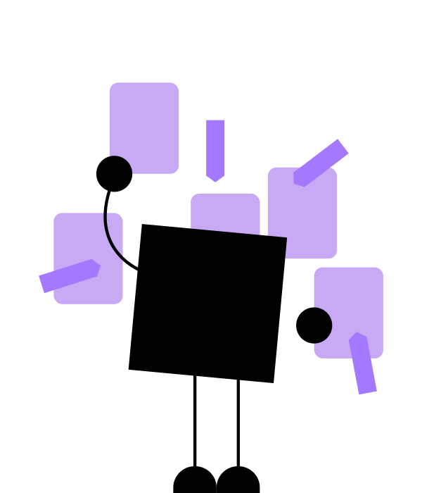

<!-- 
img/mascot/AID_1.svg - hello
img/mascot/AID_4.svg - time to study
img/mascot/AID_5.svg - X-ray interpretation
img/mascot/AID_6.svg - scanning x-ray
img/mascot/AID_7.svg - ready to fight
img/mascot/AID_8.svg - finding a treasure
img/mascot/AID_9.svg - project management
img/mascot/AID_10.svg - making a deal
img/mascot/AID_11.svg - drug dealer
img/mascot/AID_14.svg - Doing test/exam
img/mascot/AID_15.svg - Higher AI being
img/mascot/AID_16.svg - Builder
img/mascot/AID_17.svg - Play a game 
img/mascot/AID_18.svg - Gloabal influence
-->

## Enhancing Agile Processes for Medical Device Regulatory Compliance

### Overview
- Agile Processes
- Enhancements for Compliance
- Benefits

---

## User Stories and Requirements Gathering

### Regular Agile
- User stories capture user requirements.

### Enhanced for Compliance
- Use Jira for task management, linking each user story to detailed regulatory requirements.
- Utilize a regulatory-compliant formwork tool (e.g., Formwork) to document requirements, ensuring traceability and compliance.

---

## Sprint Planning

### Regular Agile
- Plan tasks and goals for the upcoming sprint.

### Enhanced for Compliance
- In Jira, incorporate tasks for regulatory compliance activities such as documentation, validation, and risk management.
- Use Formwork to specify compliance-related tasks and dependencies.

 -

---

## Daily Stand-ups

### Regular Agile
- Discuss progress, impediments, and plans.

### Enhanced for Compliance
- Include updates on regulatory compliance tasks and any impediments related to compliance.
- Use Jira to track compliance-related tasks and ensure they are addressed promptly.

 -

---

## Sprint Review

### Regular Agile
- Review completed work with stakeholders.

### Enhanced for Compliance
- Conduct formal reviews with regulatory experts using Formwork to document compliance with regulatory requirements.
- Ensure all completed work, including documentation and validation artifacts, is available for review.

---

## Sprint Retrospective

### Regular Agile
- Reflect on the sprint to improve processes.

### Enhanced for Compliance
- Review compliance activities and identify process improvements using data from Jira and feedback from regulatory experts.
- Document lessons learned regarding compliance processes and incorporate them into future sprints.

 -

---

## Backlog Grooming

### Regular Agile
- Prioritize and refine the product backlog.

### Enhanced for Compliance
- Prioritize compliance-related backlog items based on regulatory impact.
- Use Formwork to specify compliance requirements for each backlog item.

 -

---

## Design and Development

### Regular Agile
- Develop features based on user stories and design.

### Enhanced for Compliance
- Use Figma for UI/UX design, ensuring compliance with usability and regulatory requirements.
- In Azure Repos, maintain version-controlled code for compliance-critical components, ensuring traceability and auditability.

---

## Testing and Quality Assurance

### Regular Agile
- Perform testing to ensure functionality meets requirements.

### Enhanced for Compliance
- Implement unit tests for critical components using frameworks compatible with Java and Vue.js.
- Utilize MLFlow for tracking experiments and model versions, ensuring reproducibility and compliance with AI regulatory standards.

---

## Deployment and Release

### Regular Agile
- Deploy the software and release updates.

### Enhanced for Compliance
- Deploy to Azure Instances, ensuring compliance with security and privacy regulations.
- Utilize DVC for dataset versioning, ensuring reproducibility and compliance with data integrity requirements.

---

## Documentation and Reporting

### Regular Agile
- Maintain essential project documentation.

### Enhanced for Compliance
- Use Formwork for regulatory-compliant documentation, ensuring traceability and version control.
- Prepare compliance reports using data from Jira, Azure Repos, and MLFlow, demonstrating adherence to regulatory standards.

---

## Summary

- Enhanced Agile processes ensure compliance with regulatory standards while using tools like Jira, Formwork, Figma, and MLFlow.
- Maintain flexibility and efficiency of Agile methodologies while ensuring traceability, reproducibility, and compliance.
- Develop compliant, safe, and effective AI medical devices using Azure, Java, Vue.js, and DVC.