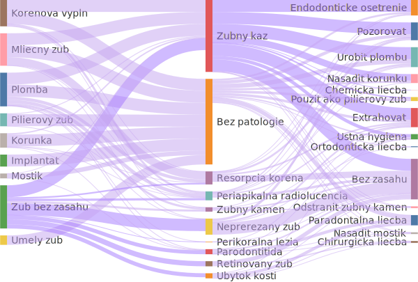

# Ako sme učili AI rozumieť X-rayom
## AI:Dental

--- 

# Problem

## Zubár
- Nekonzistentnosť
- Subjektivita
## Poisťovňa
- Žiadna kontrola

---

# Riešenie
## Poskytnúť systém, ktorý objektívne posúdi RTG snímku
- UC01 Nájdenie kazu
<!-- 
 -->

---
# Dostupné datasety v zubarine?
- Osobné údaje
- Chýbajúce súhlasy pacientov
- Chýbajúce metadáta o pacientov

---
# Vytvorenie vlastného datasetu

*140 snímok, 2 zubári, 5 mesiacov*
- 716 Kazy
- 928 Sklovina
- 842 Dentín
- 430 Plomba
- 155 Koreňová výplň

---

# UC01 Nájdenie kazu AI vs Zubár

- modrá (lekár)
- červená (ai)
- zelená (zhoda)

---

# UC02 Chýbajúca koreňová výplň
- Segmentácia

---
# UC02 Chýbajúca koreňová výplň
- Redefinovanie ~~Segmentácie~~ na **detekciu**

---

# Nový dataset

-1000 snímok, 2 skupiny po 6 zubárov, **2 mesiace**
- 1515 koreňových výplní
- ~600 chýbajucich koreňových výplní
- ~600 periapikálnych lézií

---

## Zatiaľ sme pokryli len 2-3 problémy a stálo nás to approx. 1 rok práce

---

## Rozhodovací strom zubára

---

# Ako na to ideme teraz?

---
# Anotované dáta priamo z kliniky 

---

## Kontrola kvality dát pomocou Edukačnej platformy

---

## Podarilo sa nám oanotovať

---

## Lessons learnt

- Vážte si ľudí čo challanguju vaše riešenia
- Pokiaľ chcete trénovať vlastnú AI bez dát to nepôjde
- (Update 2024) AI si viete integrovať aj bez toho aby ste ju trénovali
