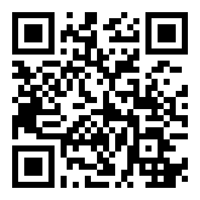
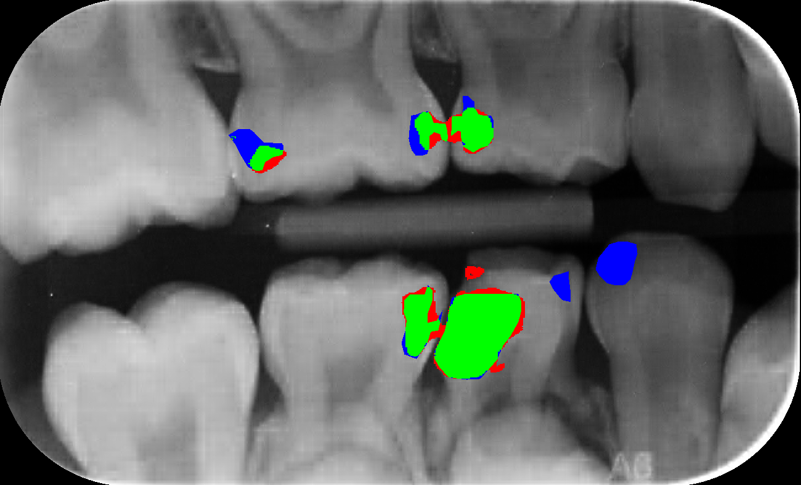

# Ako sme učili AI interpretovať RTG snímky
## AI:Dental

--- 

<!-- _color: '#000' -->
<!-- _footer: "" -->
# Brief Intro
<!-- "Hi everyone, I'm [Your Name], the CTO of [Your AI Company]. Beyond the world of technology, I'm passionate about sports, enjoy a good cup of coffee, and appreciate the art of craft beer. Today, I'm not just here to talk tech; I'm open to connecting on shared interests. Scan the QR code on my Linked for a virtual meetup. Let's dig in"
-->

Peter Jurkáček
CTO at AI:Dental

`peter.jurkacek@aidental.ai`

--- 

# Ako začať, pokračovať a neprestávať

--- 

### Ako začať?
# Znalosť domény
- Zubár, Pacient
- RTG snímka
- Anotácie / Posudok / Patológia / Kaz / Plomba
- Programátor
- ...

--- 

### RTG snímka
# Pohľad pacienta
- Vidí zuby, plomby

--- 

### RTG snímka
# Pohľad zubára
- Kazy niesú viditeľné volným okom  
- Pomocná metóda

---

### Čo potom?
# Pochopenie problému

---

### Pohľad 6 zubárov
# Subjektivita
- 3 našli, 3 nenašli
- Únava
- Rôzne skúsenosti

---

### Pohľad 1 zubára
# Konzistetnosť
- Niektoré patológie nemajú presne definované hranice

---

### Čo potom?
# Identifikácia relevatných prípadov použitia

---

### Identifikácia relevatných prípadov použitia
- > UC01 Identifikácia kazu
- > UC02 Ident. chýbajúcej koreňovej výplne
- UC03 Posúdene kvality promby
- UC04 ...

<!-- 
 -->

---

### Je to možné spraviť?
# Analýza existujúcich prístupov

---

### Analýza existujúcich prístupov
# Existujúce prístupy
- Komerčné vs Výskum
- Metódy: Segmentácia, Detekcia, Klasifikácia
- Datasety
    - Osobné údaje
    - Chýbajúce súhlasy pacientov
    - Chýbajúce metadáta o pacientoch

---

### Podme na to
# Návrh riešenia

---

# Návrh riešenia

- Semantická segmentácia
- Vlastný dataset

---

### Realizácia
# Vytvorenie vlastného datasetu
140 snímok, 1 zubár, 2 mesiace
- > 716 Kazov
- > 88 Chýbajúca výplň

---

### Realizácia
# Natreńovanie vlastného modelu
> UC01 Identifikácia kazu 
- modrá (zubár)
- červená (ai)
- zelená (zhoda)

---

### Najdlhšia fáza
# Ladenie / Redizajn
- Zlepšiť dataset
- Zlepšiť model
- Redefinovať problém & riešenie

---

### Najdlhšia fáza
# Ladenie / Redizajn
- ~~Zlepšíme dataset~~
- ~~Zlepšíme model~~
- Redefinovať prípady použitia

---

# Redefinovať prípady použitia
- Naozaj potrebujeme segmentovať kaz? -> Nie
    * Stačí keď budeme vedieť identifikovať choré zuby
    * > UC01: Posúdenie prítomnosti kazu na zube
- Naozaj potrebujeme segmentovať chýbajúcu koreňovú výplň? -> Nie
    * Mali by sme vedieť posúdiť kvalitu koreňovej výplne
    * Mali by sme vedieť posúdiť prítomnosť lézie
    * > UC02: Posúdenie kvality koreňovej výplne zuba
    * > UC03: Posúdenie prítomnosti lézie pri zube

---

### Redefinovať prípady použitia
# Rozhodovací strom zubára

---

### Redefinovať prípady použitia
> UC01 Posudzovanie zuba na prítomnosť problémov
    - kaz
    - nekvalitnej výplne
    - periapikálnej lézie
    - ...

---

# Znova treba spraviť
- Analýza existujúcich prístupov
- Návrh riešenia
- Realizácia
- Ladenie / Redizajn

---

### Realizácia
# Vytvorenie nového datasetu
- ~~140 snímok, 1 zubár,~~ 2 mesiace
1000 snímok, 1 zubár

- ~~88~~ -> 600 chýbajucich koreňových výplní
- **600 periapikálnych lézií**

 
---

# Aktuálny stav?

---

### Aktuálny stav
# Napojenie sa na klinické dáta
- Anotovanie dát pri každej návšteve pacienta 
- Zubný kríž (Čísla zubov so zoznamom patológií)

---

### Aktuálny stav
# Kontrola kvality dát
- Edukačná platforma a crowdsourcing

---

### Aktuálny stav?
- Dataset obsahuje viac ako 120 rôznych nálezov
- AI zatiaľ klasifikujeme okolo 10 nálezov pre každý zub
- Pripravujeme sa na klinickú evaluáciu

---

# Ak sa do toho chcete pustiť potrebujete
1. Znalosť domény
2. Pochopiť problém
3. Identifikovať prípady použitia
4. Analýzovať existujúce prístupy
5. Návrhnúť riešenie
6. Realizovať
7. Ladiť / Redizajnovať
