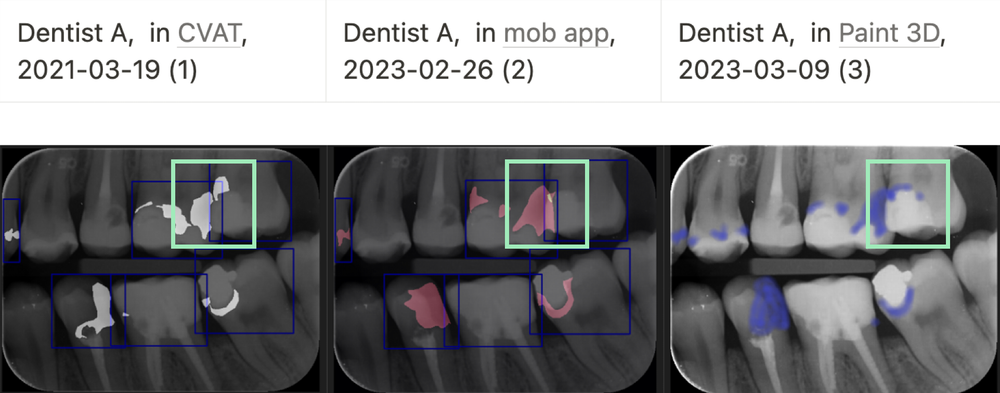

# Ako sme učili AI interpretovať RTG snímky
## AI:Dental

--- 

# Problem
- Nekonzistentnosť zubárov
- Subjektivita zubárov

---

## Návrh riešenia
### Poskytnúť systém, ktorý objektívne posúdi RTG snímku
> UC01 Nájdenie kazu
<!-- 
 -->

---
# Dostupné datasety v zubarine?
- Osobné údaje
- Chýbajúce súhlasy pacientov
- Chýbajúce metadáta o pacientoch

---
# Vytvorenie vlastného datasetu

140 snímok, 2 zubári, **5 mesiacov**
> - 716 Kazov
- 928 Sklovina
- 842 Dentín
- 430 Plomba
- 155 Koreňová výplň
- 88 Chýbajúca výplň

---

> UC01 Nájdenie kazu 
- modrá (zubár)
- červená (ai)
- zelená (zhoda)

---

## Čo vieme spraviť aby sme mali konzistentnejšie anotácie?
- Zlepšíme fokus zubára: ~~celá snímka~~ -> konkrétny zub
- Zjednodušíme anotovanie ~~kreslenie~~ -> klasifikácia

---

> UC01 Posudzovanie zubov na prítomnosť kazu
- Konkrétny zub, Klasifikácia
- Detekcia, Klasifikácia zubov

---

> UC02 Segmentácia chýbajúcej koreňovej výplne

- 88 polygónov chýbajúcej výplňe

---

> UC02 Klasifikácia koreňov s chýbajúcou koreňovou výplňou
- Namiesto polygónov budeme zberať detekované korene a klasifikovať

---

## Vytvorenie nového datasetu
~~140 snímok, 2 zubári, 5 mesiacov~~
1000 snímok, 2 skupiny po 6 zubárov, **2 mesiace**

1515 koreňových výplní, **600 chýbajucich koreňových** výplní a navyše aj **periapikálnych lézií**

---

Zatiaľ sme pokryli len 2-3 problémy a stálo nás to approx. 1 rok práce
- Vačšina bola práca s dátami

---

## Rozhodovací strom zubára

---

# Ako na to ideme teraz?

---
# Anotované dáta priamo z kliniky 
- Zubný kríž -> Zub + patológie + liečby

---

# Kontrola kvality dát
## Edukačná platforma a crowdsourcing

---

## Podarilo sa nám oanotovať approx. 
    - 120K zubov
    - 1M posudkov

---

## Lessons learnt
- Vážte si ľudí čo challanguju vaše riešenia
- Pokiaľ chcete trénovať vlastnú AI bez dát to nepôjde
- (Update 2024) AI si viete integrovať aj bez toho aby ste ju trénovali
