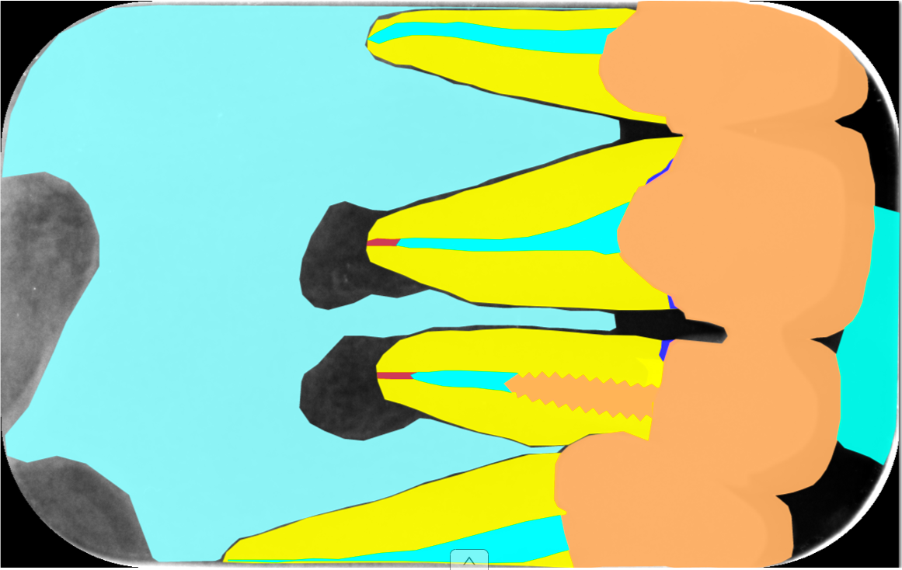
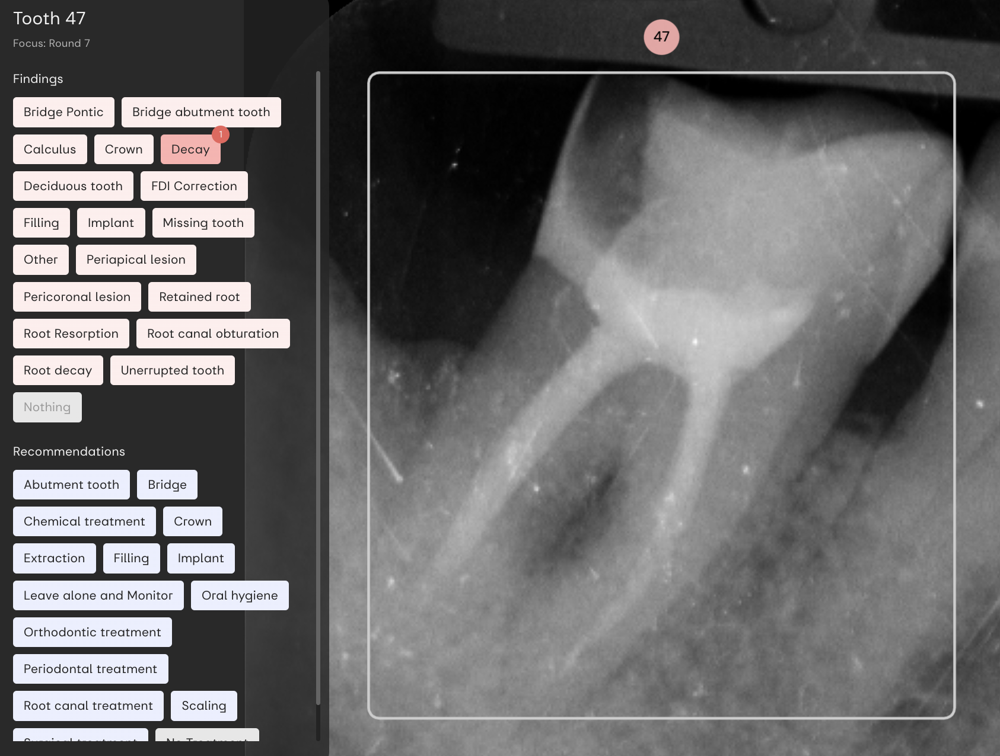

# Ako sme učili AI interpretovať RTG snímky
## AI:Dental

--- 

<!-- _color: '#000' -->
<!-- _footer: "" -->
# Brief Intro
<!-- "Hi everyone, I'm [Your Name], the CTO of [Your AI Company]. Beyond the world of technology, I'm passionate about sports, enjoy a good cup of coffee, and appreciate the art of craft beer. Today, I'm not just here to talk tech; I'm open to connecting on shared interests. Scan the QR code on my Linked for a virtual meetup. Let's dig in"
-->

Peter Jurkáček
CTO at AI:Dental

`peter.jurkacek@aidental.ai`

--- 

# Ako sme začali, pokračovali a neprestávali s AI

--- 

### Ako sme začali?
# Znalosť domény
- Interpretácia RTG snímok
- Zubár, Pacient
- Anotácie / Posudok / Patológia / Kaz / Plomba

--- 

### RTG snímka
# Pohľad pacienta
- Vidí zuby, plomby

--- 

### RTG snímka
# Pohľad zubára
- Kazy niesú viditeľné volným okom  
- Pomocná metóda

---

### Máme znalosť, čo potom?
# Identifikácia problému

---

### Pohľad 6 zubárov
# Subjektivita
- 3 našli, 3 nenašli
- Únava
- Rôzne skúsenosti

---

### Pohľad 1 zubára
# Konzistetnosť
- Niektoré patológie nemajú presne definované hranice

---

### Identifikovali sme problém, čo potom?
# Zadefinovali sme si prípady použitia

---

### Zadefinovali sme si prípady použitia
# Prípady použitia
- > UC01: Identifikácia kazu
- > UC02: Ident. chýbajúcej koreňovej výplne
- UC03: Posúdene kvality plomby
- UC04: ...

<!-- 
 -->

---

### Ako sme využili prípady použitia?
# Analýza existujúcich prístupov

---

### Analýza existujúcich prístupov
# Existujúce prístupy
- Komerčné vs Výskum
- Prístupy: 
    - Segmentácia, Detekcia, Klasifikácia
- Datasety
    - Chýbajúce súhlasy pacientov
    - Chýbajúce metadáta o pacientoch
    - Snímka je osobný údaj

---

### Ako sme využili analýzu?
# Návrh riešenia

---

# Návrh riešenia

- Semantická segmentácia
- Vlastný dataset
- > UC01: Identifikácia kazu
- > UC02: Ident. chýbajúcej koreňovej výplne

---

### Realizácia
# Vytvorenie vlastného datasetu
140 snímok, 1 zubár, 2 mesiace
- > 716 Kazov
- > 88 Chýbajúca výplň

---

### Realizácia
# Natreńovanie vlastného modelu
> UC01 Identifikácia kazu 
- modrá (zubár)
- červená (ai)
- zelená (zhoda)

---

### Neboli sme spokojní s výsledkom
# Ladenie / Redizajn
- Zlepšiť dataset
- Zlepšiť model
- Redefinovať problém & riešenie

---

### Neboli sme spokojní s výsledkom
# Ladenie / Redizajn
- ~~Zlepšíme dataset~~
- ~~Zlepšíme model~~
- Redefinovať prípady použitia

---

# Redefinovať prípady použitia
- Naozaj potrebujeme segmentovať kaz? -> Nie
    * Zubárovi stačí keď budeme vedieť identifikovať choré zuby
    * > UC01: Posúdenie prítomnosti kazu na zube
- Naozaj potrebujeme segmentovať chýbajúcu koreňovú výplň? -> Nie
    * Zubára zaujíma zlá kvalita koreňovej výplne, ktorá môže spôsobiť vznik lézie
    * > UC02: Posúdenie kvality koreňovej výplne zuba
    * > UC03: Posúdenie prítomnosti lézie pri zube

<!--  -->

---

### Checli sme aby to bolo škálovateľné
# Rozhodovací strom zubára

---

### Checli sme aby to bolo škálovateľné
> UC01: Posudzovanie problémov na zube

---

# Museli sme začať od znova
- Analýza existujúcich prístupov
- Návrh riešenia
- Realizácia
- Ladenie / Redizajn

---

### Realizácia
# Vytvorenie nového datasetu
- ~~140 snímok, 1 zubár,~~ 2 mesiace
    - 1000 snímok, 1 zubár

- ~~88~~ chýbajucich koreňových výplní
    - 600 chýbajucich koreňových výplní
    - 600 periapikálnych lézií

 
---

# Aktuálny stav?

---

### Napojili sme sa na dátový zdroj
# Klinické dáta
- Anotovanie dát pri každej návšteve pacienta 
- Zubný kríž (Čísla zubov so zoznamom patológií)

---

### Aktuálny stav
# Kontrola kvality dát
- Edukačná platforma a crowdsourcing

---

### Aktuálny stav?
# AI:Dental
- 4M posudkov
- Dataset 58 nálezov
- Aktuálne naša AI okolo 10 nálezov
- Pripravujeme sa na klinickú evaluáciu

---

# Final thoughts ako začať a neprestávať
1. Znalosť domény
2. Identifikácia problému
3. Identifikovať prípady použitia
4. Analýzovať existujúce prístupy
5. Návrhnúť riešenie
6. Realizovať
7. Ladiť / Redizajnovať
