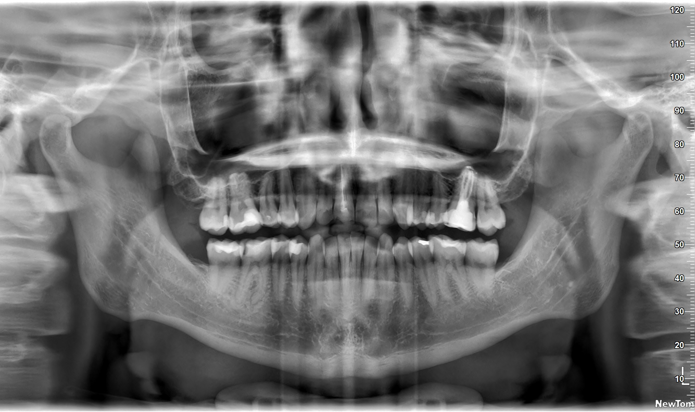
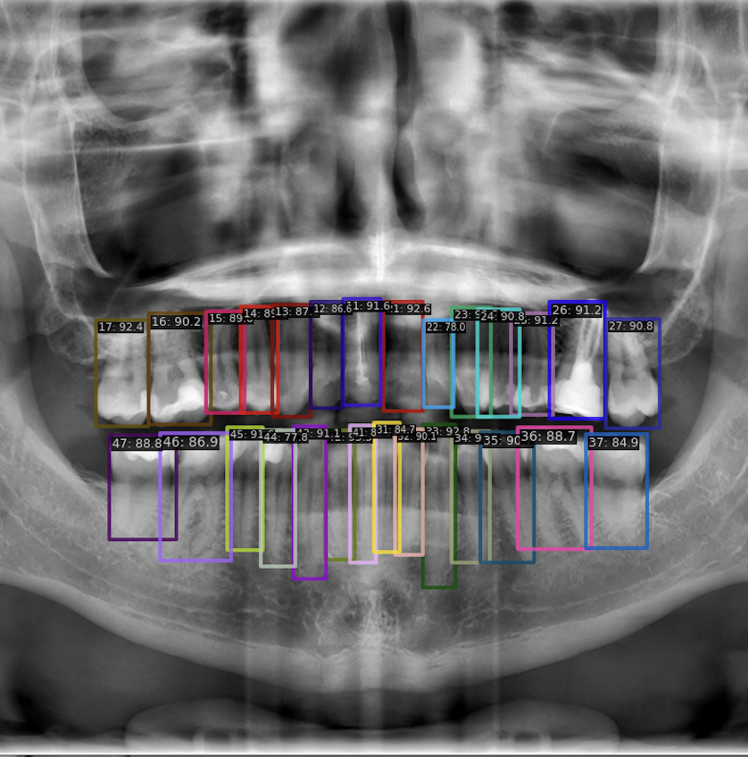
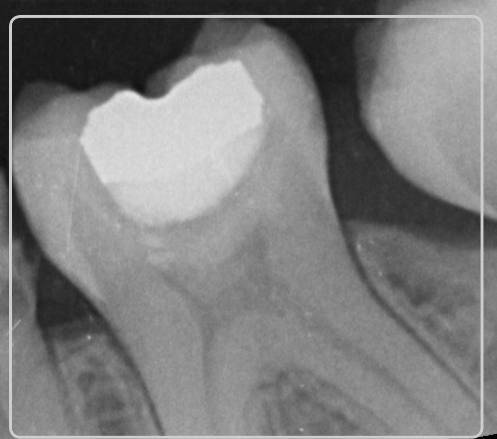
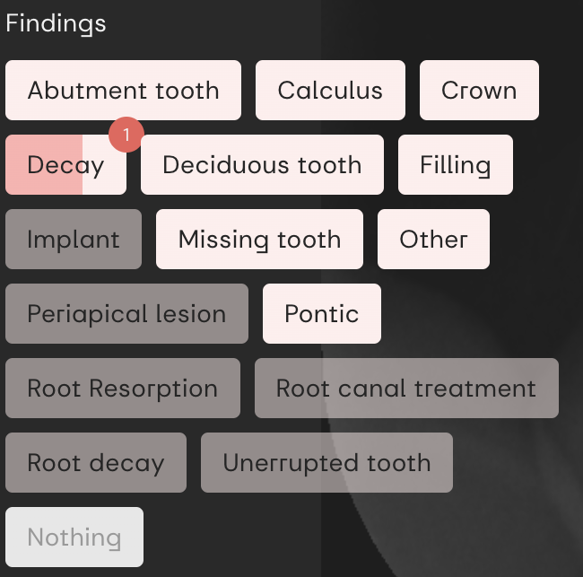
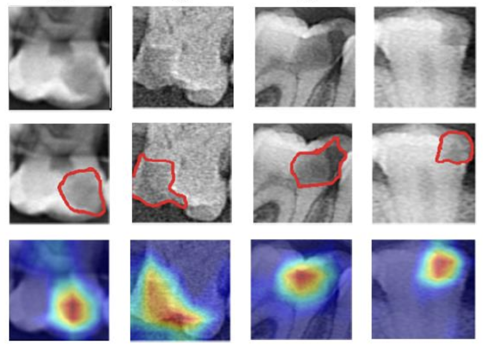

## Introduction of Dental Imaging and Its Importance in Dentistry

- Introduction of Dental Imaging and Its Importance in Dentistry
Dental imaging is a crucial tool in modern dentistry, primarily because it allows for the detection of issues that are not visible to the naked eye. One of the most significant advantages of dental X-rays is their ability to identify cavities (caries) early on, especially those that form in places difficult to examine visually, such as between teeth.
- *Bitewing radiography is commonly used to detect proximal caries, which require accurate diagnoses and early management and cannot be detected clinically due to tight contact surfaces [Gimenez et al., 2015]. Many factors, such as fatigue, emotions [Stec et al., 2018], and complex clinical environments [Hellén-Halme et al., 2008], could affect the accuracy of image interpretation.* 

- Detecting Hidden Cavities: Cavities can often go unnoticed during a routine visual examination
- Early Detection
- Comprehensive Diagnosis
- Guidance for Treatment

---

## Analysis of X-ray Images by a Dentist
1. **Identify Suspicious Regions**:
    - Dentists examine X-rays to spot abnormal areas that may indicate cavities, infections, or other issues not visible in a regular check-up.
2. **Classify Pathologies**:
    - They determine the exact nature of the identified issues, such as cavities, gum disease, or abscesses, to decide the appropriate treatment.
3. **Explain Findings to the Patient**:
    - Dentists discuss the X-ray results with the patient, explaining the findings and the necessary treatments in an understandable way.
4. **Perform the Procedure**:
    - Based on the diagnosis, dentists perform the required treatments, such as fillings, root canals, or extractions.
5. **Make an Electronic Health Record of the Visit**:
    - After the visit, dentists update the patient's Electronic Health Record (EHR), which includes a digital dental chart documenting the findings, treatments, and future care plans.

- Influence of Various Factors
The accuracy of interpreting X-ray images can be influenced by several factors, including the dentist's fatigue, emotional state, and the complexity of the clinical environment. These factors can affect the precision of diagnosis, highlighting the need for careful analysis and sometimes a second opinion to ensure accurate treatment planning.

--- 

## What is the accuracy of interpreting X-ray?
- The accuracy of interpreting X-ray images can be influenced by several factors: dentist's fatigue, emotional state, and the complexity of the clinical environment
    - Errors due to exhaustion (fatigue, emotional state)
    - Missed findings out of specialization (complexity of the clinical environment)
    - Subjectivness during interpretation (Radiological view)
    - A bunch of different pathologies (complexity of the clinical environment)
    - "If first dentist annotate that there is not a Decay there is 87% chance that second one independently will agree and 13% that second will disagree"
        - Result ((79.7 / (79.7 + 13.1))+(89.5 / (89.5 + 6.2))+(79.5 / (79.5 + 15.3)))/3 = 87%
    - "If first dentist annotate that there is Decay, there is a 34% chance that second one independedly will spot the decay, and a 66% chance that second one will not spot the decay"
        ((7.2 / (7.2 + 13.1))+(4.3 / (4.3 + 6.2))+(5.2 / (5.2 + 15.3)))/3 = 33%
        [Can a Computer Identify Carious Lesions in Dental X-Rays As Accurately As Humans?](https://www.hellopearl.com/products/second-opinion)
    - Nepripravenosť na klinickú prax (nedostatočný počet prípadov, Datasety RTG snimok zubov na internete sotva najdete)
    - Uspesnost studentov TODO%
        - Zistili sme, nie je vysoka ani medzi studentami zubariny, pricom po odpromovani nastupuju s uspesnostou okolo TODO% a nasledne zbieraju skusenosti na klinike. Toto zistenie vyplyva z existujucich studiji (Odkaz) a pri pilotnom testovani edukacnej aplikacie priemerne skore studentov bolo opdobne (Obrazok z pilotneho testovania) okolo TODO%
    - Students miss over 43% of actual caries and are only right 57% of the time they identify one, while our AI consistently outperforms them in both accuracy and reliability. [Evaluation of radiographic interpretation skills of undergraduate dental students studying in a dental college of Punjab, India – A comparative study](https://www.researchgate.net/publication/367683626_Evaluation_of_radiographic_interpretation_skills_of_undergraduate_dental_students_studying_in_a_dental_college_of_Punjab_India_-_A_comparative_study)

---

## Enhanced process of dentist with AI assisted
1. **Identify Suspicious Regions:**
Computer Vision (Object Detection): AI can be trained to automatically detect and highlight suspicious regions on X-ray images that may indicate cavities, infections, or abnormalities. This aids dentists in focusing on critical areas more efficiently.
Semantic Segmentation: AI algorithms can segment X-ray images to precisely outline areas of interest, making it easier for dentists to identify subtle pathologies that may be missed by the human eye alone.

2. **Classify Pathologies:**
Image Classification: AI can classify identified pathologies into specific categories such as cavities, gum disease, or abscesses based on patterns and characteristics extracted from X-ray images. This classification helps in determining the severity and type of treatment required.
Explain Findings to the Patient:

3. **Visual Explanations:** AI-generated visual aids, such as annotated images or diagrams overlaid on X-rays, can help dentists explain complex findings more clearly to patients.
Voice Recognition: Integrated voice recognition systems can assist dentists in dictating notes directly into the patient’s EHR, ensuring accurate and detailed documentation without the need for manual entry.
Perform the Procedure:

4. **Robotics and AI-Assisted Surgery:** While not specifically mentioned in the original context, AI can support robotic systems in performing precise dental procedures such as drilling or placing implants based on pre-determined treatment plans derived from AI analysis.

5. **Make an Electronic Health Record of the Visit:**
Automated Documentation: AI can automate the creation and updating of Electronic Health Records (EHRs) by extracting relevant data from the analysis process. This includes integrating the digital dental chart with detailed annotations and treatment plans.

---

# Challenges to Train AI in Dental Imaging

Training AI for dental imaging presents several challenges that need to be addressed to ensure accurate and effective deployment:
0. **Low amount of datasets**
- Not enough publicly available data

1. **Difficulty in Obtaining Ground Truth**
- X-ray Limitations: X-ray images serve as a supportive tool, but definitive pathology confirmation often requires clinical examination or invasive procedures like drilling.
- Need for Multi-perspective Evaluation: Accurate diagnosis demands both a radiological perspective from imaging and a clinical perspective from physical examination.

2. **Low Inter-observer Agreement**
- Subjectivity in Evaluation: Different dentists may interpret X-ray images differently, leading to varying diagnoses and treatment plans.
- Current Agreement Level: The level of inter-observer agreement is currently unknown (TODO%), highlighting variability in assessments.

3. **Multiple Imaging Modalities**
- Variety of Modalities: Dental imaging encompasses various modalities such as OPG, BW, Periapical, Cephalography, and CBCT.
- Prevalence of 2D X-rays: Despite the benefits of 3D CBCT imaging, its high radiation dose means 2D X-rays remain more commonly used.

4. **Other Challenges**
- Complex Pathologies: Dental conditions vary widely in complexity, requiring AI systems to accurately identify and classify diverse pathologies.
- Data Accessibility: Access to diverse and annotated datasets is crucial for training AI models effectively across different imaging modalities and pathologies.

Addressing these challenges involves developing robust AI algorithms capable of integrating multi-modal data, enhancing inter-observer agreement through standardized protocols, and ensuring the reliability and safety of AI-driven diagnoses in dental practice.

---

## AI:Dental AI What we are doing?

- Data Collection and Quality:
Annotation Collection: Collaborating globally to collect annotated datasets that represent real-world dental conditions, ensuring AI models are trained on diverse and accurate data.
- Comprehensive EHR Creation: Complex Dental Charting: Developing robust systems for comprehensive dental charting that extend beyond decay detection to include periapical lesions, fillings, restorations, and oral structures. Feedback from clinics indicates a need for broader coverage in dental AI capabilities.
- Pathology Complexity: Diverse Pathologies: Identifying and classifying over 20 different dental pathologies with more than 60 attributes requires sophisticated AI models trained on diverse datasets.
- Explainability: Enhancing AI Explainability: Ensuring transparency in AI-driven diagnostics to foster trust among clinicians and patients.
- Education and Training: AI in Dental Education: Introducing AI concepts in dental education to prepare future practitioners for integrating AI technologies effectively into clinical practice.
- Ethical and Regulatory Considerations: Data Privacy and Governance: Adhering to strict data privacy regulations (e.g., GDPR) and implementing governance frameworks to ensure ethical use of AI in dentistry.

---

## Data Collection for AI in Dental Imaging
Our approach to data collection integrates both clinical and radiological views, leveraging AI for tooth detection and numbering:

- Mapping Pathologies Using AI: AI for Tooth Detection and Numbering
    - AI-driven tooth detection facilitates accurate pathology mapping onto images, enhancing diagnostic precision.
    - Utilizing AI algorithms to automatically detect and label teeth within dental images.
    - Dental Chart as JSON Structure: Structuring dental records in JSON format, linking tooth numbers with identified pathologies for detailed patient history.

- Creating educational materials using AI-detected images to aid in dental training and patient education.
    - Dataset Creation for Pathology Classification
    - Building datasets for training AI models to classify various dental pathologies accurately.

- AI Architecture Utilization
    - Employing advanced architectures such as DINO (TODO architecture) for robust tooth detection and pathology classification.

- Performance Metrics: 
    - Targeting high accuracy (TODO%) across a comprehensive range of pathology classes.

- Continual Data Acquisition:
    - Ensuring ongoing collection of diverse and annotated datasets to improve AI model performance over time.
    - Number of collected pathologies with clinical view (TODO Prehľad počtu patológií z jednej kliniky)

- GDPR Compliance:
    - Adhering strictly to GDPR regulations to safeguard patient data and privacy throughout the data lifecycle.
    - Thanks to GUID: Ensuring compliance with GDPR guidelines, providing patients with rights including access, rectification, erasure, restrict processing, and data portability.

---

# Crowdsourced Collection of Opinions (Radiological View)

## Educational Application:
- **Purpose:** Recognizing the potential of our collected data, we developed an educational platform. This tool not only collects expert assessments but also enhances the educational experience by highlighting the variability in X-ray interpretations among experts and AI diagnostics.
- **Critical Thinking:** The platform teaches students to critically evaluate different interpretations, understanding that diagnostic certainty is not binary but involves varying degrees of confidence.
Agreement and Disagreement Metrics:
- **Expert Agreement**: The level of agreement among our dentists is currently being measured (TODO%). Understanding this variability is crucial for refining AI algorithms and educational content.
- **Evaluation Cases**: The system has been evaluated on a number of cases (TODO), providing a solid foundation for assessing diagnostic consistency.
- **Number of Opinions Collected:**
    - **Data Volume:** We have collected a substantial number of expert opinions (TODO), contributing to a rich dataset for training and validating our AI models.
- **Expert Involvement:** Continual expert involvement ensures that AI models are regularly updated with high-quality annotations and diverse perspectives.

By combining expert knowledge with advanced AI tools, our crowdsourced data collection approach aims to refine dental diagnostics, foster critical thinking in educational settings, and ensure the highest standards of accuracy and reliability in dental care.

--- 

### Pathology Classification in Our Company

Our approach to classifying dental pathologies employs a modular framework and incorporates multiple expert opinions to ensure accuracy and reliability. Here are the key elements of our methodology:

- **Modular Approach**:
  - We utilize a separate classifier for each specific pathology, enabling specialized and precise identification.

- **Handling Inter-observer Agreement**:
  - **Multiple Opinions**: To address variability in expert diagnoses, we collect multiple opinions for each pathology.
  - **Weighted Ground Truth**: The ground truth for training is weighted based on the average number of votes each diagnosis receives, ensuring a balanced and representative dataset.
  - **Minimum Consensus**: For each pathology classification, we require at least four expert opinions. These opinions are averaged and used as weighted inputs in the cross-entropy loss function, which has proven effective in stabilizing training.

- **Bias Correction**:
  - **MIT Methodology**: We experimented with a method from MIT to calculate annotator bias, but it did not yield satisfactory results for our needs.

- **Performance Metrics**:
  - **Success Rate**: Our classifiers aim for an accuracy rate of over TODO%, covering TODO number of pathologies.
  - **Clinical Utility**: While this system is not yet applicable for student use, we are working towards certifying it for clinical deployment to streamline administrative processes.

By employing this structured approach, we aim to enhance the accuracy and reliability of pathology classification in dental imaging, ultimately improving patient care and diagnostic efficiency.

--- 

### Visual Explanations Foster Clinical Thinking

To enhance clinical decision-making and improve the interpretability of dental X-rays, we employ AI-driven visual explanations:

- **Boundary Identification Challenges**:
  - Drawing accurate boundaries for pathologies is labor-intensive and prone to errors.

- **AI-Assisted Visualization**:
  - Our AI models create visual representations indicating potential pathology locations, reducing the need for manual annotation.

- **Heatmap Generation**:
  - Heatmaps highlight suspicious areas on X-rays, aiding users in identifying potential issues without requiring expert-drawn boundaries.
  - These heatmaps are generated once and used universally, promoting environmental sustainability by minimizing redundant computational efforts.

- **Techniques Used**:
  - **GRAD-CAM**: We utilize Gradient-weighted Class Activation Mapping (GRAD-CAM) to produce visual explanations for the AI's predictions.
  - **Addressing Negative Classes**: For negative classes, we employ GLORE (Global Relevance Explanation) to enhance interpretability and ensure comprehensive visualization.

By integrating these visual explanation techniques, we aim to support clinical thinking, enabling dentists to make more informed and accurate diagnoses based on AI-assisted imagery.

---

### Is Our AI Trustworthy?

Our commitment to trustworthiness in AI is reflected in several key areas:

- **ALTAI Score and Improvement Awareness**:
  - We utilize the ALTAI (Assessment List for Trustworthy Artificial Intelligence) score presented in a radial chart format to evaluate our AI system. While we acknowledge our strengths, we also identify areas needing improvement and actively work on them.

- **Long-term Commitment**:
  - Building a trustworthy AI is an ongoing effort, and we are dedicated to continuously enhancing our systems.

- **Key Highlights**:
  - **Integration into Education**: By incorporating AI into educational platforms, we promote better understanding and use of AI among future dental professionals.
  - **Supporting Critical Thinking**: Showing both AI and expert results helps foster critical thinking by highlighting differences and encouraging thorough analysis.
  - **Traceability Through Data Version Control**: We maintain detailed records of data versions and changes, ensuring transparency and traceability throughout the AI development process.
  - **Feedback Loop via Educational App**: Our educational app collects feedback on AI performance before it directly impacts patient care, allowing us to refine and improve our systems based on real-world use.

These measures ensure our AI is reliable, transparent, and continuously improving, thereby fostering trust among users and stakeholders.

---

RTG snimok, je dolezity lebo niektore patologie 

Podme identifikovat kazy z RTG snimok aby AI mohla zubara upozornit na pritomnost zubneho kazu. Rozhodli sme sa pouzit dostupne architektury na trhu Unet, Unet++. Rozhodli sme sa pre Model Centric approach, kde sme urobili projekt, ktorym sme vedeli skusat vsetky SOTA architektury na semanticku segmentaciu (Unet, Unet++). Ale co s datasetom? Potrebovali sme RTG snimky. Datasety RTG snimok zubov na internete sotva najdete. Aj ked najdete a zacnete ich kontrolovat tak zistite, ze obsahuju chyby. Preto sme sa rozhodli, ze si pripravime vlastny dataset RTG snimok. Nasadili sme si vlastnu instanciu anotacneho nastroja, najlepsie vyzeral opensource CVAT. V tomto nastroji sme vytvorili dataset na ktorom nam lekari polygonami ohranicovali nalezy kazov. Zvolili sme iterativny pristup pri ktorom lekar snimok oanotoval a druhy jeho zistenia nasledne validoval.

A spustili sme trenovanie s klasickym UNetom ako proof of concept to fungovalo ale model nedokazal dobre generalizovat na validacnom datasete. Podla studie, ktoru sme replikovali mal klasicky UNET mat uspesnost XY% a nam sa podarilo vytlacit F1 score na 30%. Dali sme vizaulne validovat vysledky modelu doktorovi aby nam povedal ako dobre model performuje. 

A ako sme ho pozorovali sme zistili, ze model oznacil niektore veci, ktore lekari pri anotovani prehliadli a ked boli so zisteniami konfrotovani tak uznali, ze model ma pravdu. V niektorych pripadoch striktne odmietli, ze ma model pravdu a niekedy ani sami nevedeli (False alarm). Vtedy sme si zacali uvedomovat, ze ked chcete vytvorit medicinsky dataset je to nieco ine ako ked sa snazite segmentovat macky a psov. Ako mame trenovat AI ked nemame ani nevieme ground true? Navyse ground true viete ziskat az po vyvrtani zubu pacienta a pokial chcete pre model pripravit snimok na ktorom su viacere kazy musel by zubar rozvrtat vsetky zuby pacientovi po urobeni RTG aby nam potvrdil, ze sa tam naozaj nachadzali.

Urobili sme experiment do ktoreho sme includli 8 zubarov a rozdelili im anotovat 1000 RTG snimok, pricom na kazdej snimke mali detekovane oblasti, ktore mali klasifikovat na pritomnost nalezu periapikalnej lezie. Po oanotovani sme zistili, ze z 1000 fotiek sa 100% zhodli na 500 snimkach, takze pomocou supervised pristupu sme boli schopni natrenovat model na iba na 500 snimkach.

Hlavny problem je v tom, ze na oanotovanie medicinskeho datasetu nam nestaci radiologicky pohlad ale potrebujeme aj klinicky pohlad. Ziskanie klinickeho ground true je velmi narocne lebo by bolo treba rozvrtat vsetky zuby pacientovi pocas jednej navstevy alebo v case znacit stav po rozvrtani zubu pacienta. K tomuto je potrebne aby ste boli napojeny na zdroj dat u ktoreho nam tecu data. To sa nam podarilo vdaka PMS semaforu softveru, ktory nam umoznuje zbierat data z partnerskych klinik.

Pokial nemate zaklad z ktorehe zbierate produkcne data neviete spravit robustnu AI. Totizto verejne dostupne datasety nam umoznili vyvinut iba proof of concept ale nie produkcnu AI, kedze produkcne data su castokrat bohatsie na šum. 

Kedze sme si uvedomovolali potencial dat, ktore mame chceli sme vytvorit nastroj cez ktory dokazeme zbierat posudky a zaroven pomocou zvysit uroven vzdelanosti pri interpretacii RTG snimok. Preto sme implementovali Edukacnu platformu v ktorej poukazujeme na nejednoznacnost interpretacie aj medzi expertami aj pri diagnostikou AI a snazime sa studentom ukazat tieto nazory aby k nim pristupovali kriticky a uvedomovali si, ze pri interpretaci nie je binarna odpoved ano nie ale miera istoty. 

Vyvinutie crowdsourcovej platformy nie je trivialne 

Preto sme sa rozhodli, ze budeme zbierat aj klinicky aj radiologicky. Navyse interpretacia RTG snimok nie je trivialna ani pre expertov. Ked sme zacali venovat tejto problematike a snazili sme sa odhalit podstatu nizkej uspesnosti interpretacie zistili sme, nie je vysoka ani medzi studentami zubariny, pricom po odpromovani nastupuju s uspesnostou okolo 50% a nasledne zbieraju skusenosti na klinike. Toto zistenie vyplyva z existujucich studiji (Odkaz) a pri pilotnom testovani edukacnej aplikacie priemerne skore studentov bolo opdobne (Obrazok z pilotneho testovania) okolo 50%

Expected documentation in wps

3.3 Proposed Method
3.1 Preprocessing
3.3.2 Model framework
3.3.3 Model training
4. Experimental results
4.1 Tooth segmentation and labeling
4.2 Tooth finding classification
4.3 Qualitative results and failures
5. Discussion / Next steps

Cize identifikovali viacere problemy
- 
- Inter-observer variability
- RTG je iba pomocna metoda

- Nakreslime kazy pomocou polygonu
- Value:
    - Pomahame zubarovi vizualne komunikovat pacientovi kazy
    - Pacientovi ale pomahame mu zefektivnit pracu?
- Gotchas:
    - Zubar/sestricka stale musi manualne zapisovat vsetky nalezy do electronic health reccords
    - Stanovanie

Na riesenie Intra observer variability sme zacali zberat viacere nazory. Podarilo sa nam stabilizovat trening vdaka aplikovaniu vahovanej cross entropie, ktora sa estimatuje pre kazdeho anotatora bias v jeho odpovediach. Pre nas sa ako najlepsie ukazalo vahovanie ground true podla priemerneho poctu votov, ktore dostalo. 

Navyse ked sme prezentovali AI klinikam zistili sme, ze klinike nestacia kazy ale chceli by aj periapikalne lezie, plomby, restoracie, struktury v ustach. Preto pokial chceme pomoct zubarovi komplexne skontrolovat usta pacienta a identifikovat vsetky nalezy, ktore sa tam mozu vyskytovat zistili sme ze s datasetom, ktory obsahuje iba kazy si nevystacime. Mnozstvo patologii, ktore musi doktor urcite je XY. Ale ako vieme vytvarat datasety pre ktore neviem ani ground true.

Co sme zistili?
- detecting decays is not enought
- interobserver variability
- intraobserver variability
- hard to find ground true
- softlabels can stabilize traning
- radiological view vs clinical view
- radiograph is considered as personal data
- edukacia nam pomaha ziskavat feedback
- prinasanie hodnoty offline

- Semantic segmentation of carries
- Semantic segmentation of structures
- BW Tooth detection
- OPG Tooth detection
- Restoration classification
- Finding classification

---

GDPR:
- Data minimization, Personal data removal (Privacy)
- GUID: Right to Access, Rectification, Erasure, Restrict Processing, Data Portability (Data Governance)
- Informed consents (Data Governance)

Scope: It applies to all companies that process personal data of individuals residing in the EU, regardless of the company's location.
Personal Data: Any information related to an identified or identifiable natural person, such as names, addresses, email addresses, IP addresses, and more.
Rights of Individuals:

Right to Access: Individuals have the right to access their personal data and obtain information on how it is being used.
Right to Rectification: Individuals can request correction of inaccurate personal data.
Right to Erasure (Right to be Forgotten): Individuals can request the deletion of their personal data under certain conditions.
Right to Restrict Processing: Individuals can request the limitation of the processing of their personal data.
Right to Data Portability: Individuals can request their personal data in a commonly used format to transfer it to another controller.
Right to Object: Individuals can object to the processing of their personal data for certain purposes.
Data Protection Principles:

Lawfulness, Fairness, and Transparency: Data processing must be lawful, fair, and transparent to the data subject.
Purpose Limitation: Data must be collected for specified, explicit, and legitimate purposes and not further processed in a manner incompatible with those purposes.
Data Minimization: Data collected must be adequate, relevant, and limited to what is necessary for the purposes for which it is processed.
Accuracy: Data must be accurate and kept up to date.
Storage Limitation: Data must be kept in a form that permits identification of data subjects for no longer than necessary.
Integrity and Confidentiality: Data must be processed in a manner that ensures its security.
Accountability and Governance:

Organizations must implement appropriate technical and organizational measures to ensure and demonstrate compliance.
Organizations may need to appoint a Data Protection Officer (DPO) if they process large amounts of personal data or engage in certain types of processing activities.
Data Breaches: Organizations must report certain types of data breaches to the relevant supervisory authority within 72 hours of becoming aware of the breach.

Penalties: Non-compliance can result in significant fines, up to €20 million or 4% of the annual global turnover of the preceding financial year, whichever is higher.

---
<!-- Ahoj potrebujem pripravit prezentaciu obecenstvo, ktore su to AI researchers, AI students a tiez ludia z firiem pouzivajucich AI, ktori su vcelku technologicky zdatni. Vzdy ich zaujima, ako sa riesia rozne specificke vyzvy (vo nasom pripade napriklad image recognition, false positives/negatives, ako sa trenovala AI, ako ste spracuvali datasety atd. - skratka technicke zaujimavosti). 

v prezentacii sa da aj nieco povedat k tomu ake AI pristupy pouzivame
dolezite -- NIE JE TO REKLAMA PRODUKTU A ANI FIRMY, TO JE KONTRAPRODUKTIVNE, a poskodi to vsetkych

treba mat na pameti, ze su tam AI ludia, ktori sa chcu nieco nove dozvediet ohladom toho co sa vam podarilo, nepodarilo s AI, aku architekturu je dobre pouzit pre nejake pripady, s cim ste mali vacsi problem, ako ste sa vysporiadali s doveryhodnostou (vybrate aspekty), kde vidite este medzery...

samozrejme to co mozete zdielat, ale dolezite, aby tam bol potencial na pridanu hodnotu
ludi napr. nebudu zaujimat medicinske certifikacie, ale to ako sa snazite zabezpecovat transparentnost moze byt zaujimave -->

References
[(2023) Detection of Proximal Caries Lesions on Bitewing Radiographs Using Deep Learning Method](https://karger.com/cre/article/56/5-6/455/841972/Detection-of-Proximal-Caries-Lesions-on-Bitewing)
*Bitewing radiography is commonly used to detect proximal caries, which require accurate diagnoses and early management and cannot be detected clinically due to tight contact surfaces [Gimenez et al., 2015]. Many factors, such as fatigue, emotions [Stec et al., 2018], and complex clinical environments [Hellén-Halme et al., 2008], could affect the accuracy of image interpretation.*

*The F1-score of the students was 0.57, while the F1-score of the network was 0.74 despite the accuracy of 0.82. A significant difference in the sensitivity was found between the model and the postgraduate students when detecting different stages of lesions (p < 0.05). For early lesions which limited in enamel and the outer third of dentin, the neural network had sensitivities all above or at 0.65, while students showed sensitivities below 0.40. From our results, we conclude that the CNN may be an assistant in detecting proximal caries on bitewings.*

Prezi statement:
Students miss over 43% of actual caries and are only right 57% of the time they identify one, while our AI consistently outperforms them in both accuracy and reliability.

---

<!-- _paginate: skip -->
# AI:Dental
## Shaping the future of Artificial and Human Intelligence hand in hand in dentistry

---

# AI:Dental
Developing AI and Education Platform for dentistry to enhance Diagnostic Accuracy and Education in Dentistry

### Speaker: Peter Jurkáček, CTO

---

<!-- _footer: "1. 2022 Evaluation of radiographic interpretation skills of undergraduate dental students studying in a dental college of Punjab, India – A comparative study" -->
# Problem
## Success rate of interpreting X-ray images by dental students ranges from **48% - 65%**[1]

---

# What is the sucess rate of your own dentist?

- It's hard to tell
- Based on study is 70%

---

# Why?

- Errors due to exhaustion
- Missed findings out of specialization
- A bunch of different pathologies
- Pathologies are hidden until hole is drilled (Clinical view)
- X-ray image is just a pomocna metoda 
- Subjectivness during interpretation (Radiological view)
    - Inter-rater variability
    - Intra-rater variability

---

## Expert's decision tree
1. Identify suspicious regions
2. Classify pathologies
3. Explain findings to patient
4. Perform procedure
5. Make a Electronic Health reccord of visit

---

## AI solution
1. Identify suspicious regions (Object detection, Instance segmentation)
2. Classify pathologies (Image classification)
3. Explain findings to patient (Visual explanation, Test explanation)
4. Perform procedure (~~Robotics~~)
4. Make a Electronic Health reccord of patients visit (1, 2, 3)

---

# AI

---

Education platform 
Crowdsourcing platform

---

**Deep Learning**: Utilized convolutional neural networks (CNNs) for image recognition tasks.

**Data Augmentation**: Techniques to improve training data diversity and model robustness.

**Transfer Learning**: Leveraging pre-trained models to enhance diagnostic accuracy.

**Explainable AI**: Implementing methods to ensure transparency and interpretability in AI predictions.

---

# Training the AI

**Datasets**:
- Sourced from diverse dental imaging modalities.
- Crowdsourcing for annotation and validation.

**Training Process**:
- Data preprocessing: normalization, augmentation.
- Model training: leveraging GPU acceleration.
- Validation: Cross-validation techniques to ensure model reliability.

**Challenges**:
- Imbalanced datasets: Addressed using synthetic data generation and oversampling techniques.
- Noise in data: Applied denoising algorithms to enhance data quality.

---

# Technical Challenges and Solutions

**False Positives/Negatives**:
- Implemented ensemble methods to reduce prediction errors.
- Continuous model refinement with active learning strategies.

**Scalability**:
- Optimized model deployment using cloud-based infrastructure.
- Containerization with Docker for efficient scaling and maintenance.

**Integration with Clinical Workflows**:
- Developed APIs for seamless integration with existing dental software.
- User-friendly interfaces to encourage adoption by dental professionals.

---

# Ensuring Trustworthiness

**Transparency**:
- Explainable AI techniques to make model decisions understandable to users.
- Comprehensive logging and monitoring to track model performance over time.

**Bias Mitigation**:
- Regular audits of training data for bias.
- Implemented fairness constraints in model training.

**Security and Privacy**:
- Data encryption and secure storage solutions.
- Compliance with GDPR and other relevant regulations.

---

# Current Gaps and Future Directions

**Gaps**:
- Limited real-world validation due to regulatory constraints.
- Need for more diverse datasets to enhance model generalizability.

**Future Directions**:
- Expanding dataset collection through partnerships with dental clinics.
- Research into multimodal AI systems combining imaging and textual data.
- Development of adaptive learning systems for personalized dental education.

---

# Case Study: AI in Action

**Scenario**: Diagnosing dental caries using AI:Dental AI.

**Approach**:
- Data collection: High-resolution dental images.
- Model deployment: Integration with clinic's diagnostic software.
- Results: Improved diagnostic accuracy and reduced patient wait times.

**Lessons Learned**:
- Importance of user feedback in model refinement.
- Balancing automation with human expertise for optimal outcomes.

---

# Interactive Q&A Session

**Encourage Audience Engagement**:
- Invite questions on technical aspects, challenges, and future directions.
- Foster a discussion on best practices and emerging trends in AI for healthcare.

---

# Conclusion

**Recap**:
- AI:Dental’s innovative solutions in dental care and education.
- Key technical achievements and ongoing challenges.
- Commitment to transparency, trustworthiness, and continuous improvement.

**Call to Action**:
- Engage with us for potential collaborations.
- Stay connected for updates on our latest research and developments.

---

