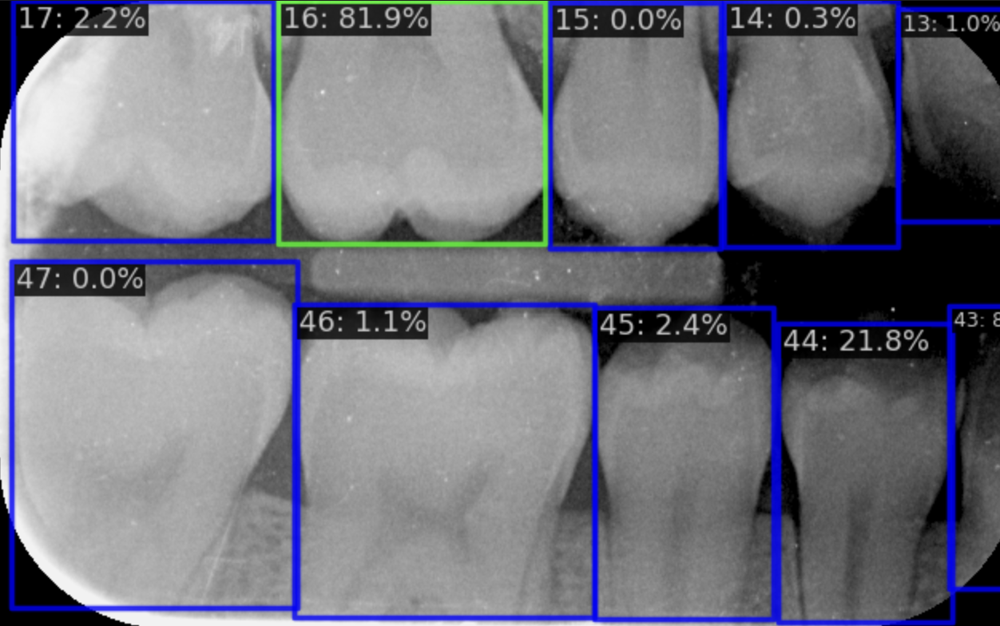
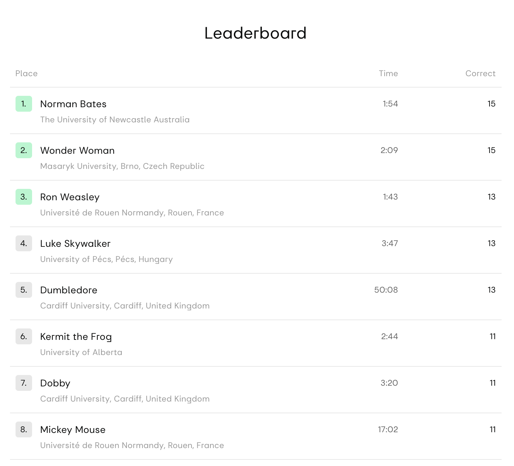

<!--_footer: "" -->

## Shaping the future of artificial and human intelligence hand in hand in dentistry
### AI:Dental

---

# Speakers

- Peter Jurkáček, CTO (peter.jurkacek@aidental.ai)
- Olga Shebanova, Co-Ceo (olga.shebanova@aidental.ai)

---

# AI:Dental
Zlepšiť interpretovanie RTG snímok študentom aj zubárom pomocou umelej inteligencie

---

# Clinical AI:D
### Simulácia rozhodovacieho stromu zubára pri interpretácií RTG snímok

---

# Otestujte sa

- https://adee.aidental.ai

---

## AI bez vás existovať nebude
- Datasety pre AI vytvárajú ľudia
- Viaceré expertné názory nám pomáhajú vytvárať objektívnu AI

---

V spolupráci s Vami by sme chceli vytvoriť AI-riešenie, ktoré pomôže hľavne Vám a Vašim pacientom

---

# Demo

---

## Naše ciele

- Šetriť vám čas
- Zvýšiť presnosť
- Zvýšiť dôveru pacientov 
- Zabezpečiť skorú detekciu

<!-- - Zvýšená presnosť: AI spoľahlivo zachytí jemné problémy, ktoré môžu byť prehliadnuté ľudským okom, čím sa znižujú chyby v diagnostike.

- Úspora času: Automatizovaná analýza vám ušetrí cenný čas, ktorý môžete využiť na starostlivosť o pacientov a plánovanie liečby.

- Konzistentnosť: AI poskytuje konzistentné diagnostické výsledky bez ohľadu na úroveň skúseností zubára, čím sa znižujú rozdiely v diagnózach.

- Dôvera pacientov: Diagnózy podporované AI dodávajú pacientom ďalšiu vrstvu istoty a môžu zvýšiť dôveru v liečebný plán.

- Skorá detekcia: AI dokáže zachytiť problémy už v skorých štádiách, čo vám umožňuje zamerať sa na preventívnu starostlivosť namiesto reaktívnej liečby. -->

---

## Spolupráca
# Klinická Evaluácia AID v SK Dental

---

## Čo je to klinická evaluácia?

- Klinická evaluácia umožňuje objektívne vyhodnotiť funkčnosť AID produktu priamo vo vašej praxi.
- Spoločne zistíme, čo funguje a ktoré aspekty treba upraviť pre maximálny prínos pre vašich pacientov.

<!--  -->
<!--  -->

---

## Prečo je pre vás dôležitá?

- Máte možnosť byť súčasťou technologického pokroku v stomatológii.
- Pochopíte, ako AID zapadne do vašej praxe a prinesie hodnotu vám, vašej klinike a pacientom.

---

# Ako Bude Prebiehať Klinická Evaluácia

---

## Spolupráca počas evaluácie:

- Prvé stretnutie na nastavenie a integráciu AID do vašej praxe.
- Zaznamenávanie skúseností a spätných väzieb pre optimalizáciu AID na vaše potreby.
- Pravidelná konzultácia a podpora počas celej evaluácie.

---

## Čo očakávať po evaluácii:

- Detailná správa s výsledkami a odporúčaniami pre optimálne využitie AID vo vašej klinike.

---

# Ďalšie Kroky Po Úspešnej Evaluácii

---

## Integrácia AID do vašej praxe:

- Na základe evaluácie AID prispôsobíme vášmu pracovnému procesu pre hladkú integráciu.
- Pomoc s oficiálnou integráciou, vrátane tréningu a technickej podpory.

--- 

## Dlhodobé výhody spolupráce:

- Zlepšenie kvality diagnostiky a liečby.
- Neustále aktualizácie AID podľa najnovších technológií v stomatológii.
- Prístup k inovatívnym funkciám a aktualizáciám počas celého partnerstva.

