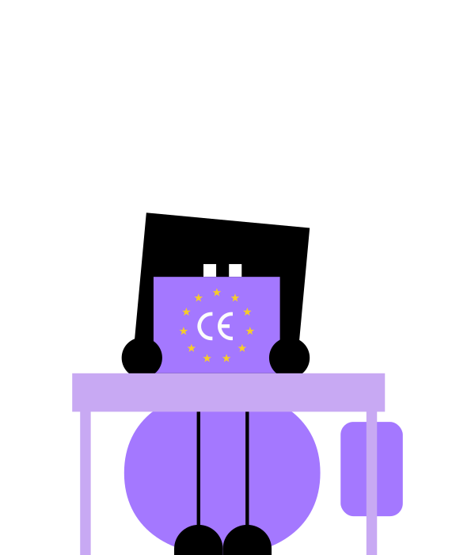

<!--_footer: "" -->

## AI:Dental
# Clinical AI:D

<!-- --- -->

<!--  -->

---

# Výzvy pri interpretácii röntgenových snímok

- Komplexné rozhodovacie procesy
- Časové obmedzenia
- Nekonzistentnosť

---

# Prečo AI pre zubnú diagnostiku?

- Pomáha pri rozhodovacom procese
- Analýza snímky do pár sekúnd
- Konzistnetnosť

---

# Naše AI-riešenie pre diagnostiku röntgenových snímok
- Vstup: Röntgenové snímka
- Analýza: Systém AI využíva neurónové siete na analýzu snímky. Dokáže spoľahlivo detegovať a zvýrazniť bežné zubné problémy, ako sú kazy, zlomeniny, infekcie koreňov či ochorenia ďasien.
- Výstup: Poskytne vám podrobnú správu, ktorá zvýrazní problematické zuby a zoznam problémov, čím vám pomôže, aby sa nič neprehliadlo.
*Vizuály: Jednoduchý diagram pracovného postupu alebo snímku rozhrania softvéru AI so zvýraznenými anomáliami na ukážkovej röntgenovej snímke.*

---

# Demo

---

## Naše ciele

- Šetriť vám čas
- Zvýšiť presnosť
- Zvýšiť dôveru pacientov 
- Zabezpečiť skorú detekciu

<!-- - Zvýšená presnosť: AI spoľahlivo zachytí jemné problémy, ktoré môžu byť prehliadnuté ľudským okom, čím sa znižujú chyby v diagnostike.

- Úspora času: Automatizovaná analýza vám ušetrí cenný čas, ktorý môžete využiť na starostlivosť o pacientov a plánovanie liečby.

- Konzistentnosť: AI poskytuje konzistentné diagnostické výsledky bez ohľadu na úroveň skúseností zubára, čím sa znižujú rozdiely v diagnózach.

- Dôvera pacientov: Diagnózy podporované AI dodávajú pacientom ďalšiu vrstvu istoty a môžu zvýšiť dôveru v liečebný plán.

- Skorá detekcia: AI dokáže zachytiť problémy už v skorých štádiách, čo vám umožňuje zamerať sa na preventívnu starostlivosť namiesto reaktívnej liečby. -->

---

## A čo ďalej?
# Klinická Evaluácia AID v SK Dental

---

## Čo je to klinická evaluácia?

- Klinická evaluácia umožňuje objektívne vyhodnotiť funkčnosť AID produktu priamo vo vašej praxi.
- Spoločne zistíme, čo funguje a ktoré aspekty treba upraviť pre maximálny prínos pre vašich pacientov.

<!--  -->
<!--  -->

---

## Prečo je pre vás dôležitá?

- Máte možnosť byť súčasťou technologického pokroku v stomatológii.
- Pochopíte, ako AID zapadne do vašej praxe a prinesie hodnotu vám, vašej klinike a pacientom.

---

# Ako Bude Prebiehať Klinická Evaluácia

---

## Spolupráca počas evaluácie:

- Prvé stretnutie na nastavenie a integráciu AID do vašej praxe.
- Zaznamenávanie skúseností a spätných väzieb pre optimalizáciu AID na vaše potreby.
- Pravidelná konzultácia a podpora počas celej evaluácie.

---

## Čo očakávať po evaluácii:

- Detailná správa s výsledkami a odporúčaniami pre optimálne využitie AID vo vašej klinike.

---

# Ďalšie Kroky Po Úspešnej Evaluácii

---

## Integrácia AID do vašej praxe:

- Na základe evaluácie AID prispôsobíme vášmu pracovnému procesu pre hladkú integráciu.
- Pomoc s oficiálnou integráciou, vrátane tréningu a technickej podpory.

--- 

## Dlhodobé výhody spolupráce:

- Zlepšenie kvality diagnostiky a liečby.
- Neustále aktualizácie AID podľa najnovších technológií v stomatológii.
- Prístup k inovatívnym funkciám a aktualizáciám počas celého partnerstva.

