<!-- _paginate: skip -->
# Vytváranie ľudskej a umelej inteligencie
## V čom je rozdiel v zubarine?
<!-- ## Ovládnutie sveta ešte počká -->
<!--
- Víta študentov na seminári.
- Stručný prehľad programu. 
-->

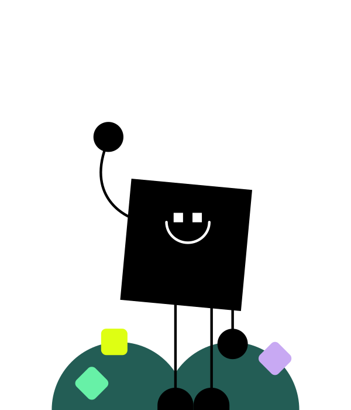

---

# Team
# 
# 
# 
# 
# 
# 
# 
# 

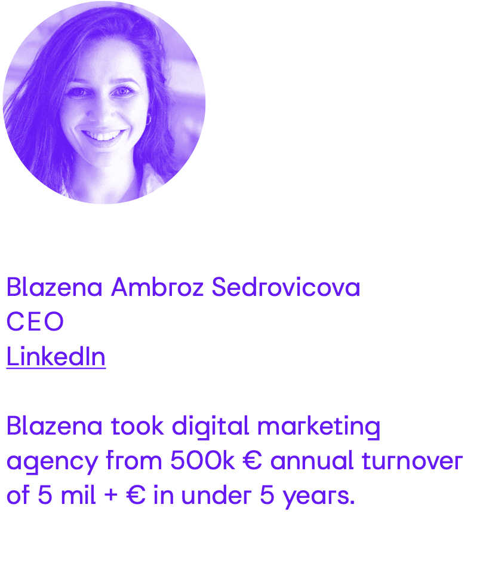

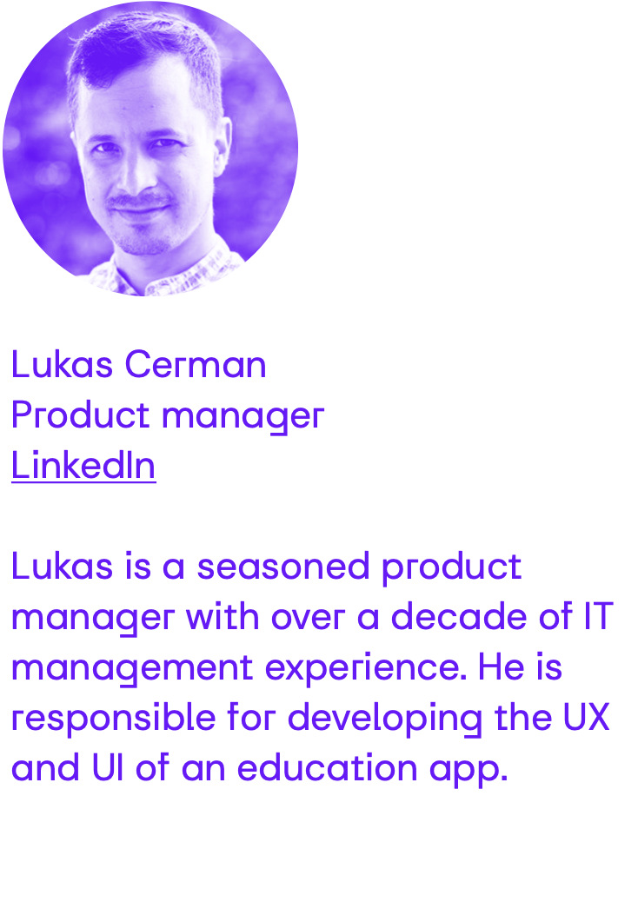
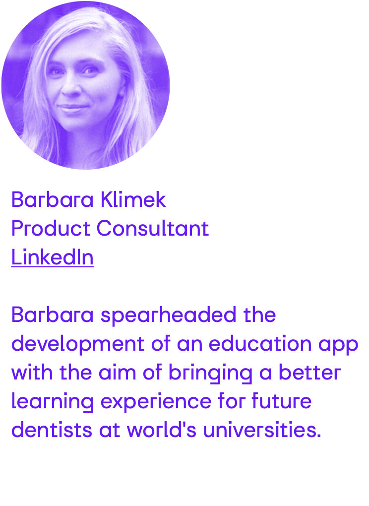

---

<!-- Porozumenie UI v Diagnostike -->
# Umelá Inteligencia?
*Umelá inteligencia (UI) je **simulácia ľudskej inteligencie** procesmi počítačových systémov.*
(2024, ChatGPT)

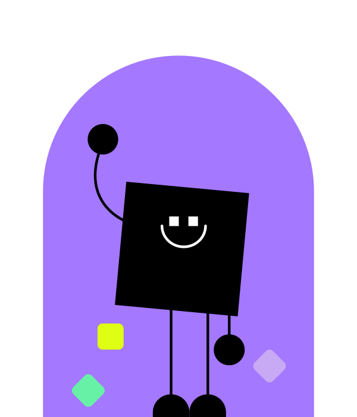

---

# Ľudská Inteligencia?
## **Zubný lekár**, ktorý dokáže interpretovať RTG snímku

<!-- 
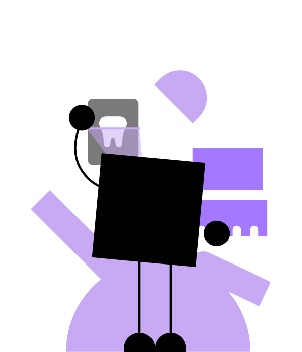 -->

---

# Simulácia ľudskej inteligencie?
## **Umelá Inteligencia**, ktorá dokáže interpretovať RTG snímku


---

# Ako vieme vytvoriť umelú inteligenciu?

---

## 1. Definovanie komplexnej úlohy
* Naučiť sa interpretovať zubný kaz z RTG snímky
## 2. Návrh cvičenia:
* Pripravíme sériu 100 RTG snímok, pričom budú obsahovať zuby s alebo bez zubného kazu a UI sa bude snažiť posúdiť, či je alebo nie je prítomný kaz
## 3. Vyhodnotenie úspešnosti
* Porovnáme odpovede UI so správnymi odpoveďami
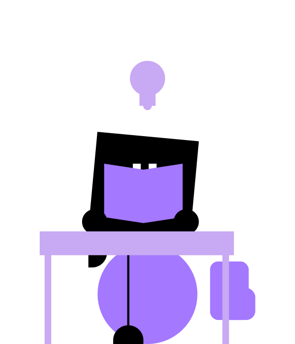

---

# Ako vieme vytvoriť Chatbot?

---

## 1. Definovanie komplexnej úlohy
* Naučiť sa odpovedať na vstupnú vetu od používateľa
## 2. Návrh cvičenia
* Pripravíme 1000 viet, pričom niektoré slová vo vetách vynecháme a budeme chcieť aby ich Umelá inteligencia doplnila
## 3.Vyhodnotenie úspešnosti
* Vyhodnotíme, či slová, ktoré umelá inteligencia doplnila sa zhodujú s tými, ktoré sme odstránili


---

# Ako vieme vytvoriť umelú intelegenciu na ovládnutie sveta?

---

## 1. Definovanie komplexnej úlohy
* Naučiť umelú inteligenciu ovládať svet
## 2. Návrh cvičenia
* ?
## 3.Vyhodnotenie úspešnosti
* Svet je ovládnutý umelou inteligenciou


---

# Ako vieme vytvoriť ľudskú intelegenciu?

--- 

## Definovanie komplexnej úlohy:
* Naučiť študenta interpretovať zubný kaz z RTG snímky
## Návrh cvičenia:
* Pripravíme sériu 100 RTG snímok, pričom budú obsahovať zuby s alebo bez zubného kazu a UI sa bude snažiť posúdiť, či je alebo nie je prítomný kaz
## Vyhodnotenie úspešnosti
* Porovnáme odpovede študenta so správnymi odpoveďami a vypočítame jeho úspešnosť

---

<!-- _footer: "1. 2022 Evaluation of radiographic interpretation skills of undergraduate dental students studying in a dental college of Punjab, India – A comparative study" -->

# Inteligencia študentov pri interpretácií RTG snímok?
## **Úspešnosť interpretácie RTG snímok študentov** zubariny sa pohybuje od **48% - 65%**<sup>[1]</sup>

---

# Poďme to spoločne zmeniť
## Agenda na dnes:
1. Spoznávanie
2. Úlohy a cvičenia
3. Vytvorenie umelej inteligencie
4. Spätná väzba

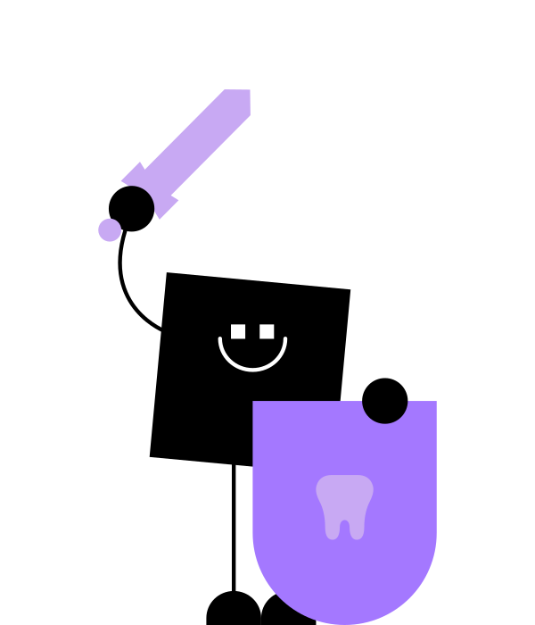

---

# 1. Spoznávanie

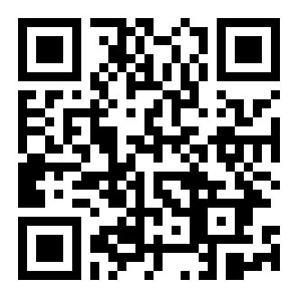

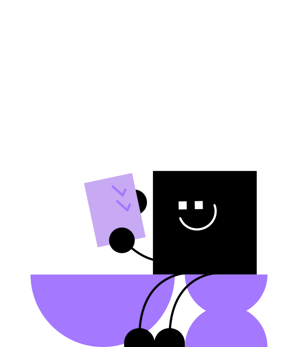


---

# 2. Úlohy a Cvičenia
Pokúsime sa naučiť riešiť 3 úlohy cez našu vzdelávaciu aplikáciu

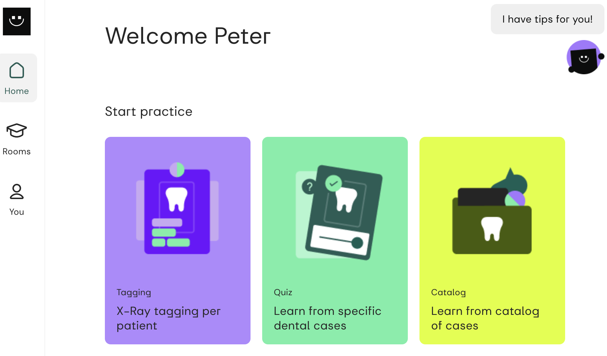

---

## Úloha 2.1
- Naučiť sa **identifikovať retinovaný zub**

## Cvičenie
- Kvíz v edu appke

## Vyhodnotenie úspešnosti
- Dosiahnuté skóre v edu appke

Q&A

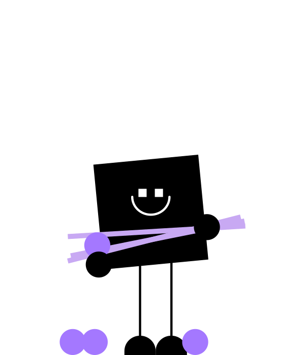

---
## Úloha 2.2
- Naučiť sa **identifikovať zubné restorácie**

## Cvičenie
- Tagovanie celých RTG snímok
- Pracovanie s Katalógom prípadov

## Vyhodnotenie úspešnosti
- Dosiahnuté skóre v aplikácií 

Q&A


---
## Úloha 2.3
- Naučiť sa **odporúčiť liečbu**

## Cvičenie
- Odporuč liečbu (treatment)
- Diskutuj sa o sporných prípadoch (použi Feedback)

## Vyhodnotenie úspešnosti
- Dosiahnuté skóre v aplikácií

Q&A


---

# 3. Ako vieme vytvoriť umelú inteligenciu, ktorá dokáže identifikovať Retinovaný zub?

---

## Úloha
- Naučiť umelú inteligenciu identifikovať retinovaný zub na snímke
## Cvičenie
* Dataset
    ```bash
    t0_retained_tooth_classification
    ├── negative  [57 entries exceeds filelimit, not opening dir]
    └── positive  [37 entries exceeds filelimit, not opening dir]
    ```
* Trénovací skript

## Vyhodnotenie úspešnosti
- Dosiahnuté skóre pri evaluacií

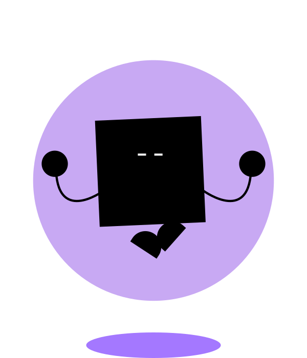

---

# 4. Feedback a Q&A

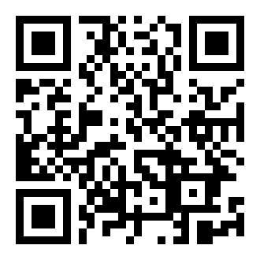


