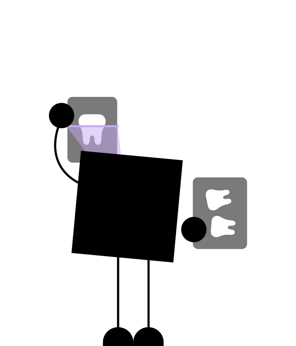
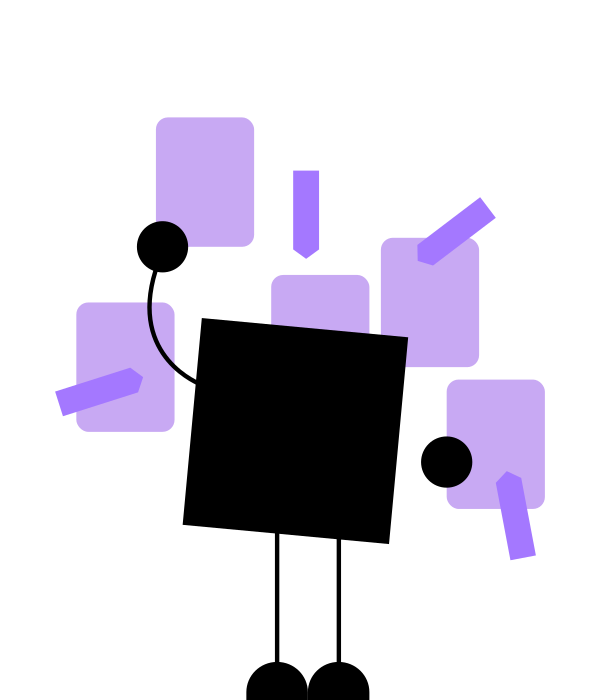

<!-- _paginate: skip -->
# Demystifikácia **umelej inteligencie**
Cvičennia pre diagnostiku röntgenových snímok
<!--
- Víta študentov na seminári.
- Stručný prehľad programu. 
-->

---

<!-- Porozumenie UI v Diagnostike -->
# Umelá Inteligencia?

*Umelá inteligencia (UI) je **simulácia ľudskej inteligencie** procesmi počítačových systémov.*

---

# Ľudská Inteligencia?
## **Zubný lekár**, ktorý dokáže interpretovať RTG snímku

<!-- 
 -->

---

# Simulácia ľudskej inteligencie?
## **Umelá Inteligencia**, ktorá dokáže interpretovať RTG snímku

---

# Ako vieme vytvoriť umelú inteligenciu?
- Definovanie cieľa:
    * Naučiť sa interpretovať zubný kaz z RTG snímky
- Návrh cvičenie:
    * Pripravíme sériu 100 RTG snímok, pričom budú obsahovať zuby s alebo bez zubného kazu a UI sa bude snažiť posúdiť, či je alebo nie je prítomný kaz
- Vyhodnotenie úspešnosti
    * Porovnáme odpovede UI so správnymi odpoveďami

---

# Ako vieme vytvoriť Chatbot?
- Definovanie cieľa:
    * Naučiť sa odpovedať na vstupnú vetu od používateľa
- Návrh cvičenie:
    * Pripravíme 1000 viet, pričom niektoré slová vo vetách vynecháme a budeme chcieť aby ich Umelá inteligencia doplnila
- Vyhodnotenie úspešnosti
    * Vyhodnotíme, či slová, ktoré umelá inteligencia doplnila sa zhodujú s tými, ktoré sme odstránili

---

# Ako vieme vytvoriť ľudskú intelegenciu?
- Definovanie cieľa:
    * Naučiť študenta interpretovať zubný kaz z RTG snímky
- Návrh cvičenie:
    * Pripravíme sériu 100 RTG snímok, pričom budú obsahovať zuby s alebo bez zubného kazu a UI sa bude snažiť posúdiť, či je alebo nie je prítomný kaz
- Vyhodnotenie úspešnosti
    * Porovnáme odpovede študenta so správnymi odpoveďami a vypočítame jeho úspešnosť

---

<!-- _footer: "1. 2022 Hodnotenie radiografickej interpretačnej zručnosti pregraduálneho študenta stomatológie študujúceho na stomatologickej fakulte v Punjabi, India - Porovnávacia štúdia" -->

# Inteligencia študentov pri interpretácií RTG snímok?
## **Úspešnosť interpretácie RTG snímok študentov** zubariny sa pohybuje od **48% - 65%**[1]

---

# Poďme to spoločne zmeniť
## Agenda na dnes:
1. Spoznávanie
2. Cvičenia, porovnajte sa s našimi expertmi
3. Cvičenie/Trénovanie UI a vyhodnotenie jej úspešnosti
4. Feedback

---

# 1. Spoznávanie

---

# 2. Cvičenia
- Kvíz
- Tagovanie podľa pacienta
- Katalóg prípadov

---

# 3. Cvičenie/Trénovanie UI a Vyhodnotenie jej úspešnosti
- Skóre UI
- Vaše skóre

<!--  -->

---

# 4. Feedback a Q&A

- Podielanie sa na návhru cvičení
- Podielanie sa na príprave cvičení

