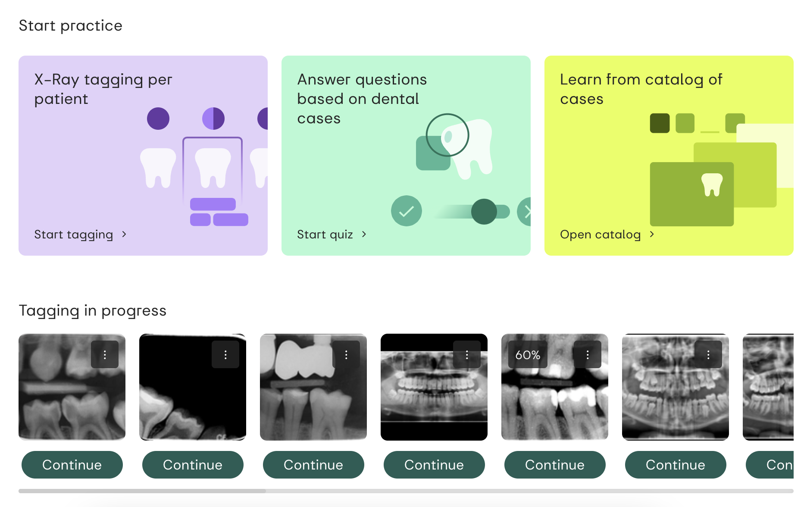

<!-- _paginate: skip -->
# Demystifikácia diagnostiky RTG-snímok pomocou **UI**
Ponorme sa spolu do cvičení pre diagnostiku röntgenových snímok
<!--
- Víta študentov na seminári.
- Stručný prehľad programu. 
-->

---

<!-- Porozumenie UI v Diagnostike -->
# Čo je **UI**?

*Umelá inteligencia (UI) je **simulácia ľudskej inteligencie** procesmi počítačových systémov.*

---

### **Ľudská Inteligencia** pri diagnostike RTG?
# Inteligencia zubného profesionála
1. Vyhotoviť röntgenový snímok
2. **Interpretovať röntgenový snímok**
3. Urobiť rozhodnutie

---

### **Simulácia** ľudskej inteligencie pri diagnostike RTG?
# Umelá Inteligencia
1. Vyhotoviť röntgenový snímok
2. **Interpretovať röntgenový snímok**
3. Urobiť rozhodnutie

---

<!-- _footer: "1. 2022 Hodnotenie radiografickej interpretačnej zručnosti pregraduálneho študenta stomatológie študujúceho na stomatologickej fakulte v Punjabi, India - Porovnávacia štúdia" -->

Interpretácia röntgenových snímok
<!--  -->

#
#
#
# Inteligencia študentov pri diagnostike?
Presnosť interpretácie röntgenových snímok študentov zubariny sa pohybuje od **48% - 65%**[1]

---

# Ako vieme vytvárať ľudskú inteligenciu?
- Úloha
- Cvičenie
- Hodnotenie

---

## Ako vieme vytvárať inteligenciu u študentov pri diagnostike?

# Pohľad profesora
* Úloha: Chcel by som naučiť mojich **študentov**, ako klasifikovať zubný kaz z röntgenového snímku
* Cvičenie: Musím pre nich navrhnúť cvičenie (napr. sériu vizuálnych otázok a odpovedí)
* Hodnotenie: Musím vyhodnotiť ich výkon

# Pohľad študenta
* Úloha: Chcel by som vedieť, ako klasifikovať zubný kaz z röntgenového snímku
* Cvičenie: Musím robiť cvičenia (napr. interpretovať aspoň 100 röntgenov s zubným kazom)
* Hodnotenie: Ak dosiahnem viac ako 90%, som pripravený

---

## Ako vieme vytvárať umelú inteligenciu pri diagnostike?

# Pohľad Programátora UI
* Úloha: Chcel by som naučiť mojich **~~študentov~~ UI**, ako klasifikovať zubný kaz z röntgenového snímku
* Cvičenie: Musím pre nich navrhnúť cvičenie (napr. sériu vizuálnych otázok a odpovedí)
* Hodnotenie: Musím vyhodnotiť ich výkon

# Pohľad UI
- Úloha: Moja úloha je vedieť, ako klasifikovať zubný kaz z röntgenového snímku
- Cvičenie: Musím robiť cvičenia (napr. interpretovať aspoň 100 röntgenov s zubným kazom)
- Hodnotenie: Ak dosiahnem viac ako 90%, som pripravený

---
# Poďme spoločne preskúmať na budovanie inteligencie pri diagnostike RTG snímok

1) Budeme sa spoznávať
2) Prejdeme si naše cvičenia v interpretácii röntgenov, porovnajte sa s našimi expertmi
3) UI prejde naše cvičenia
4) Uvidíme porovnanie medzi vami a našou UI

---

# 1. Spoznajme sa
- Dotazník

---

# 2. Naše Cvičenia
- Kvíz
- Tagovanie podľa pacienta
- Katalóg prípadov

---

# 3. Cvičenia UI
- Trénovací proces UI
- Hodnotenie

---

# 4. Porovnanie
- Skóre UI
- Vaše skóre

