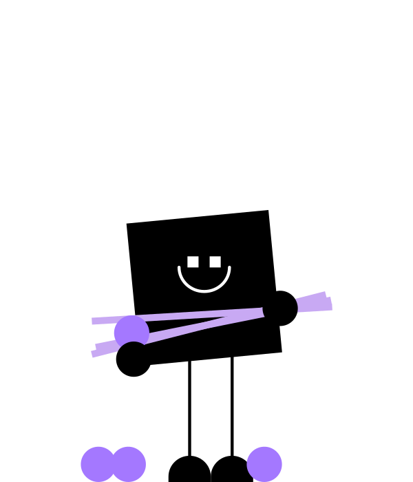

<!-- _paginate: skip -->
# Creating Human and Artificial Intelligence
## What's the Difference in Dentistry?
<!-- ## Mastery of the World Will Have to Wait -->
<!--
- Welcoming students to the seminar.
- Brief overview of the program.
-->


---
<!--  -->


<!--  -->

---

<!-- Understanding UI in Diagnostics -->
# Artificial Intelligence?
*Artificial intelligence (AI) is the **simulation of human intelligence** processes by computer systems.*
(2024, ChatGPT)


---

# Human Intelligence?
## **Dentist** who can interpret an X-ray image

<!-- 
 -->

---

# Simulation of Human Intelligence?
## **Artificial Intelligence** capable of interpreting an X-ray image


---

# How Do We Create Artificial Intelligence?

---

## 1. Defining a Complex Task
* Learn to interpret tooth decay from X-ray images
## 2. Exercise Design:
* Prepare a series of 100 X-ray images, some containing teeth with or without decay, and the AI will attempt to assess whether decay is present or not
## 3. Evaluating Success
* Compare AI responses with correct answers


---

# How Do We Create a Chatbot?

---

## 1. Defining a Complex Task
* Learn to respond to user input sentences
## 2. Exercise Design
* Prepare 1000 sentences, omitting some words, and require the Artificial Intelligence to complete them
## 3. Evaluating Success
* Evaluate whether the words filled in by the AI match those we removed


---

# How Do We Create Artificial Intelligence to Rule the World?

---

## 1. Defining a Complex Task
* Teach artificial intelligence to rule the world
## 2. Exercise Design
* ?
## 3. Evaluating Success
* The world is ruled by artificial intelligence


---

# How Do We Create Human Intelligence?

--- 

## Defining a Complex Task:
* Teach a student to interpret tooth decay from X-ray images
## Exercise Design:
* Prepare a series of 100 X-ray images, some containing teeth with or without decay, and the student will attempt to assess whether decay is present or not
## Evaluating Success:
* Compare the student's responses with the correct answers and calculate their accuracy

---

<!-- _footer: "1. 2022 Evaluation of radiographic interpretation skills of undergraduate dental students studying in a dental college of Punjab, India – A comparative study" -->

# Students' Intelligence in Interpreting X-ray Images?
## **Success rate of interpreting X-ray images by dental students** ranges from **48% - 65%**<sup>[1]</sup>

---

# Let's Change That Together
## Agenda for Today:
0. Turning on Notebooks
1. Introduction
2. Tasks and Exercises
3. Creating Artificial Intelligence
4. Feedback


---

# 0. Turning on Notebooks
- Connect to wifi: eduroam

*NOTE: If unsuccessful, use wifi PVPWIFI without a password*

---

# 1. Introduction

<!-- 1.insights https://aidental.typeform.com/to/tj0bf15M -->


---

# 2. Tasks and Exercises
- Logging into the app
- Trying to solve 3 tasks through our educational application


---
<!-- _footer: "" -->

## Task 2.1
- Learning to **identify a retained tooth**

## Exercise
- Quiz in the educational app

## Evaluating Success
- Score achieved in the educational app

Q&A



---
<!-- _footer: "" -->

## Task 2.2
- Learning to **identify dental restorations**

## Exercise
- Tagging entire X-ray images
- Working with Case Catalog

## Evaluating Success
- Score achieved in the applications 

Q&A


---
<!-- _footer: "" -->

## Task 2.3
- Learning to **comprehensively interpret X-rays and recommend treatment**

## Exercise
- Tag entire X-ray images
- Recommend treatment
- Discuss controversial cases (use Feedback)

## Evaluating Success
- Score achieved in the applications

Q&A


---

# 3. How Do We Create Artificial Intelligence Capable of Identifying a Retained Tooth?

---

## Task
- Teach artificial intelligence to identify a retained tooth in an image
## Exercise
* Dataset
    ```bash
    t0_retained_tooth_classification
    ├── negative  [57 entries exceeds filelimit, not opening dir]
    └── positive  [37 entries exceeds filelimit, not opening dir]
    ```
* Training script

## Evaluating Success
- Score achieved in evaluations


---

# 4. Feedback and Q&A

<!-- 2. feedback https://aidental.typeform.com/to/H1VOWNrR -->


