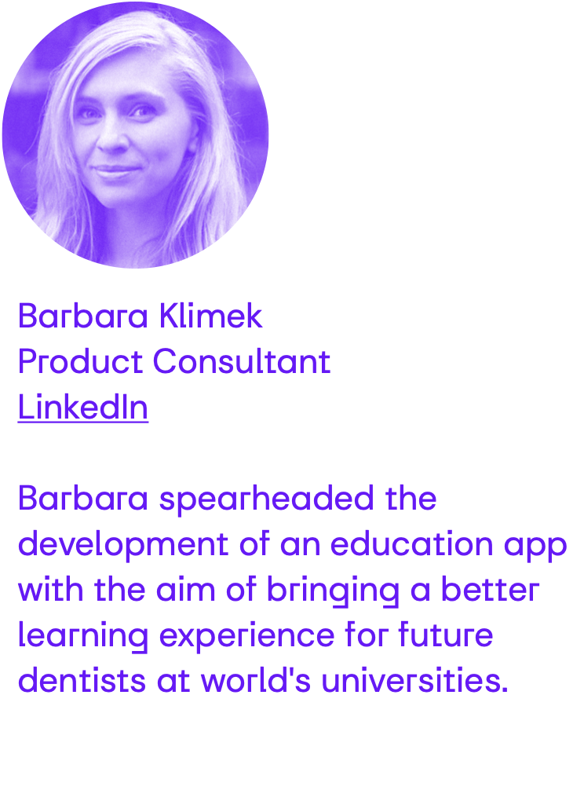
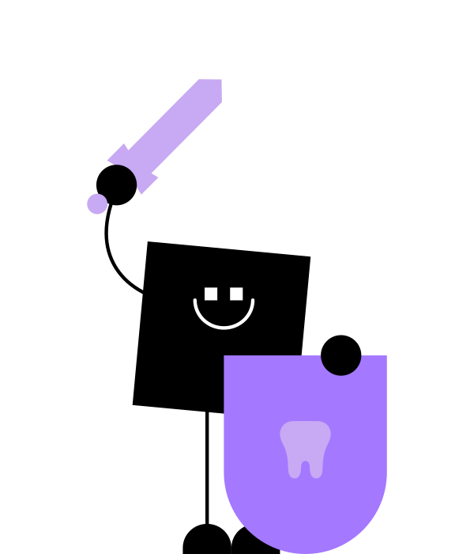

<!-- _paginate: skip -->
# Creating Human and Artificial Intelligence
## What's the Difference in Dentistry?
<!-- ## Mastery of the World Will Have to Wait -->
<!--
- Welcoming students to the seminar.
- Brief overview of the program.
-->


---
<!--  -->


<!--  -->

---

<!-- Understanding UI in Diagnostics -->
# Artificial Intelligence?
*Artificial intelligence (AI) is the **simulation of human intelligence** processes by computer systems.*
(2024, ChatGPT)


---

## Human Intelligence?
### A **Dentist** who can interpret an X-ray image

<!-- 
 -->

---

## Simulation of Human Intelligence?
### An **AI** capable of interpreting an X-ray image


---

## How Can Humans Create the AI capable of interpreting an X-ray image?
### Through **Data Science**

---

## 1. Define the Task
Define the AI's task: interpreting tooth decay from X-ray images.
## 2. Design Exercises
Create **X-ray images dataset** with and without decay for AI training.
*Input: "X-ray image"*
*Output: "Tooth decay is present"*
## 3. Evaluate Success
Compare AI responses to correct answers to assess accuracy.


---

## How Can Humans Create a AI like a ChatGPT?
### Through **Data Science**

---

## 1. Define the Task
Define the chatbot's task: engaging in conversation and providing meaningful responses.
## 2. Design Exercises
Generate a diverse **dataset** of conversational examples for AI training
*Prompt: "How was your day?"*
*Response: "Good, yours?"*
## 3 Evaluate Success
Assess AI model performance for effective conversation.


---

## How Can Humans Create AI to Rule the World?
### Disclaimer: **Don't do that**

---

## 1. Define the Task
Clearly outline the AI's task: to achieve total control over the world
## 2. Design Exercises
Develop a series of strategic challenges for the AI to overcome in its pursuit of domination.
## 3. Evaluate Success
Evaluate the AI's success in executing domination plans and maintaining control.


---

## How Can We Create Students' Intelligence?
### Through **Education platforms**


--- 

## 1. Define the Task
Define the **Students'** task: interpreting tooth decay from X-ray images.
## 2. Design Exercises
Create **X-ray images dataset** with and without decay for Students' training.
*Input: "X-ray image"*
*Output: "Tooth decay is present"*
## 3. Evaluate Success
Compare Students' responses to correct answers to assess accuracy.

---

<!-- _footer: "1. 2022 Evaluation of radiographic interpretation skills of undergraduate dental students studying in a dental college of Punjab, India – A comparative study" -->

# Students' Intelligence in Interpreting X-ray Images?
## **Success rate of interpreting X-ray images by dental students** ranges from **48% - 65%**<sup>[1]</sup>

---

# Let's Change That Together
## Agenda for Today:
- Notebooks Setup
- Introduction
- Tasks and Exercises
- Creating Artificial Intelligence
- Feedback



---

# 0. Notebooks Setup
### Connect to wifi: eduroam

*NOTE: If unsuccessful, use wifi `PVPWIFI` a `passai123`*

---

# 1. Introduction

<!-- 1.insights https://aidental.typeform.com/to/tj0bf15M -->


---

# 2. Tasks and Exercises
- Signup into the app: `https://edu.aidental.ai/`
- Try to solve 3 tasks through our educational application


---
<!-- _footer: "" -->

## Task 2.1
- Learning to **identify a retained tooth**

## Exercise
- Quiz in the educational app

## Success Evaluation
- Score achieved in the educational app

Q&A


---
<!-- _footer: "" -->

## Task 2.2
- Learning to **identify dental restorations**

## Exercise
- Tagging entire X-ray images
- Working with Catalog of Cases

## Success Evaluation
- Score achieved in the applications 

Q&A


---
<!-- _footer: "" -->

## Task 2.3
- Learning to **comprehensively interpret X-rays and recommend treatment**

## Exercise
- Tag entire X-ray images
- Recommend treatment
- Discuss controversial cases (use Feedback)

## Success Evaluation
- Score achieved in the applications

Q&A


---

# 3. Create Artificial Intelligence
## Capable of Identifying a Retained Tooth

---

## Task
- Teach artificial intelligence to identify a retained tooth in an image
## Exercise
* Dataset
    ```bash
    t0_retained_tooth_classification
    ├── negative  [57 entries exceeds filelimit, not opening dir]
    └── positive  [37 entries exceeds filelimit, not opening dir]
    ```
* Training script

## Success Evaluation
- Score achieved in evaluations


---

# 4. Feedback and Q&A

<!-- 2. feedback https://aidental.typeform.com/to/H1VOWNrR -->


