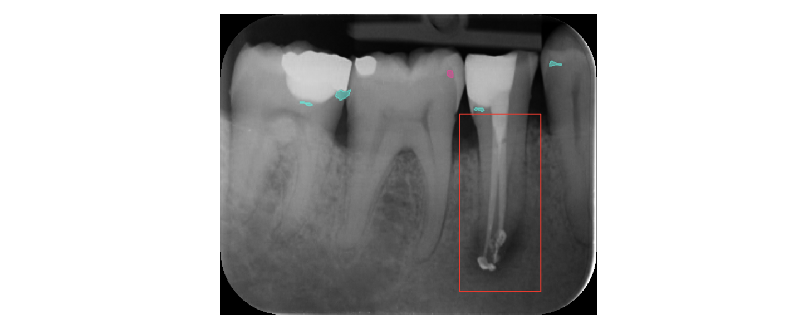

<!-- _paginate: skip -->
# AI:Dental
## Shaping future of Artificial and Human Intelligence hand in hand in dentistry

---

# AI:Dental
Developing AI and Education Platform for dentistry to enhance Diagnostic Accuracy and Education in Dentistry

### Speaker: Peter Jurkáček, CTO

<!-- Greetings, I'm PJ, a CTO. I have Master's degree in Computer Science and Artificial Intelligence from the Slovak University of Technology in Bratislava. 
I have five years of experience working as a full-stack developer and a full-stack data scientist. Now, I lead technology strategy and innovation as CTO. -->

---

# Agenda
- What is Artificial Inteligence (AI)?
- Utilizing AI in AI:Dental
- Process of creating intelligence in dentistry
- Will we be overruled by AI?

---

# What is **AI**?

*Artificial Intelligence (AI) is the **simulation of human intelligence processes** by computer systems.*

--- 

# Human intelligence processes in dentistry?
**Dental professional**, examining dental x-rays

---

# Simulation of Human Intelligence processes?
~~Dental professional~~**Artificial intelligence**, who is able to detect suspicious regions in dental x-rays and classify pathologies

---

<!-- 
Differentiating Human Intelligence and Artificial Intelligence 
-->
# Human intelligence processes
* **Human** with ability to solve different complex tasks

# Simulation of Human intelligence processes
* **Algorithms** with ability to solve different complex tasks

---

# Complex task
Complex task refers to a problem or objective that demands sophisticated computational methods, such as machine learning, natural language processing, computer vision, or other AI techniques

---

# AI:Dental's Complex Tasks
## Computer vision *(Images)*
- T01: Detect Suspicious Regions in dental x-rays
- T02: Classify dental conditions and abnormalities for specific region
- T03: Visual explanation to aid dentist in interpretation
- T04: Provide suggestions for appropriate treatment for specific region

## Natural language processing *(Text)*
- T05: Interactive learning with real-time guidance

## Multimodal *(Images + Text)*
- T06: Search for relevant X-ray images

---

### Computer vision task
# T01: Detect Suspicious Regions in dental x-rays
- Input: X-ray image
- Methods: DINO (Object detector)
- Output: Region of interest represented by x, y, width, height coordinates

<!-- _footer: "[(2022) DINO: DETR with Improved DeNoising Anchor Boxes for End-to-End Object Detection](https://arxiv.org/abs/2203.03605)" -->
---

### Computer vision
# T02: Classify dental conditions and abnormalities for specific region

- Input: Region of interest + X-ray image
- Methods: EfficientNet (Image classifier)
- Output: Severe tooth decay

<!-- _footer: "[(2019) EfficientNet: Rethinking Model Scaling for Convolutional Neural Networks](https://arxiv.org/abs/1905.11946)" -->

---

### Computer vision
# Provide suggestions for appropriate treatment

- Input: Region of interest + X-ray image
- Methods: EfficientNet (Image classifier)
- Output: Root canal treatment

<!-- _footer: "[(2019) EfficientNet: Rethinking Model Scaling for Convolutional Neural Networks](https://arxiv.org/abs/1905.11946)" -->

---

### Computer vision
# T03: Visual explanation to aid dentist in interpretation.

- Input: Region of interest
- **Method:** GALORE, Grad-CAM, Grad-CAM++
- Output: Saliency map

---

## Multimodal
# T06: Search for relevant X-ray images

- Input: Text or X-ray image prompt
- Methods: 
  - Image encoder (ResNet-50)
  - Text encoder (DistilBERT)
  - Projection function
- Output: The most similiar X-ray image

<!-- _footer: "[(2023) Dental CLAIRES: Contrastive LAnguage Image REtrieval Search for Dental Research](https://www.ncbi.nlm.nih.gov/pmc/articles/PMC10283104/)"-->

---

## Natural language processing
# Real-time guidance

- Input: Question, Student's answer, Correct answer
- **Method:** 
  - Cusomized chatbot (e.g. Chatgpt)
    - Response Generation and Control with low temperature
    - Knowledge Management with external knowledge bases
    - Conversation Flow Management with chain of thought prompting
    - Robustness and Reliability with building defensive APIs and user interfaces
- Output: Clarification of correct answer

---

# But how can we create those AIs?

---

# Process of creating an AI
- Task Definition:
  * Identifying the objectives and goals of the AI system learning process
- Exercise (Training) creation: 
  * Prepare dataset
  * Development of training procedure/activity/script
- Performance Evaluation
  * Performance metrics definition
  * Development testing procedure/activity/script

---

## Process of creating AI
- Task Definition: 
  * T02 Classify dental conditions and abnormalities for specific region
- Exercise Creation
  * Prepare dataset: 1000 train samples (x-rays + expert opinions)
  * Training procedure: Supervised learning
- Performance Evaluation
  * Performance metrics definition: Precision, Recall, F1score
  * Testing procedure: Compare AI on 100 test samples (x-rays + expert opinions)

---

## Process of creating AI
- Task Definition: 
  * T06 Search for relevant X-rays
- Exercise Creation
  * Prepare dataset: 1000 train samples (x-rays + expert opinions)
  * Training procedure: Contrastive Learning
- Performance Evaluation
  * Performance metrics definition: Precision, Recall, F1score
  * Testing procedure: Compare AI on 100 test samples (x-rays + expert opinions)

---

# What about creating Human Intelligence?

---

# Process of creating Human Intelligence
- Task Definition: 
  * T02 Classify dental conditions and abnormalities for specific region
- Exercise Creation
  * Prepare dataset: 1000 train samples (x-rays + expert opinions)
  * Training procedure: https://edu.aidental.ai (tagging per patient, quiz)
    - Supervised learning
- Performance Evaluation
  * Performance metrics definition: Precision, Recall, F1score
  * Testing procedure: Compare their answers on 100 test samples (x-rays + expert opinions)

---

# Can AI Conquer the World?

---

# Process of creating AI
- Task Definition: 
  * T2024 Conquer the world
- Exercise Creation
  * Dataset: ?
  * Training procedure: ?
- Performance Evaluation
  * Performance metrics: ?
  * Testing procedure: ?

---

## AI Regulations
- Current regulations
- Ensuring Trustworthiness in AI Systems
- Ethical considerations
- Adherence to privacy regulations in handling patient data.
- Bias and discrimination
- Transparency, accountability, and fairness in AI algorithms

---

## Q&A
- AI - simulation of human intelligence
- Complex tasks in dentistry
- Process of creating AI and HI with examples
- Will we be overruled by AI?
- The role of regulations in AI development
