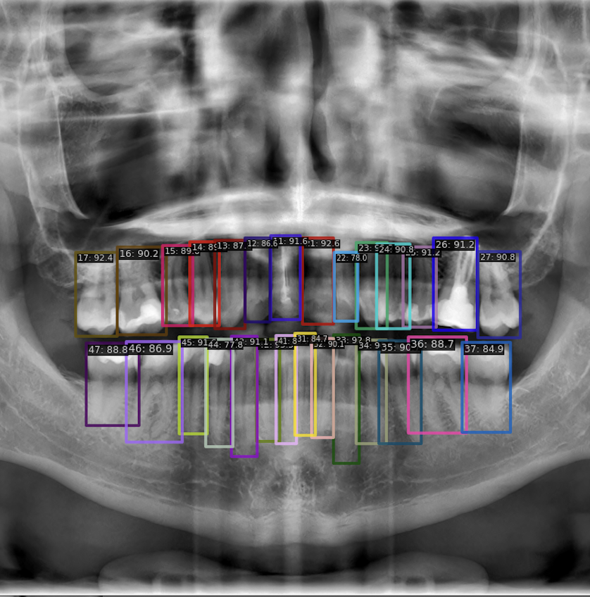
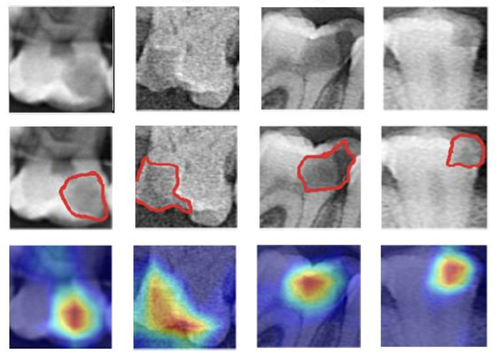
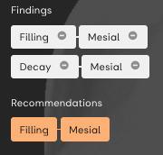

<!-- _paginate: skip -->
# AI:Dental
## Shaping the future of Artificial and Human Intelligence hand in hand in dentistry

---

# AI:Dental
Developing AI and Education Platform for dentistry to enhance Diagnostic Accuracy and Education in Dentistry

### Speaker: Peter Jurkáček, CTO

<!-- Greetings, I'm PJ, a CTO. I have Master's degree in Computer Science and Artificial Intelligence from the Slovak University of Technology in Bratislava. 
I have five years of experience working as a full-stack developer and a full-stack data scientist. Now, I lead technology strategy and innovation as CTO. -->

---

## Agenda
- What is Artificial Inteligence (AI)?
- Utilizing AI in AI:Dental
- Process of creating intelligence in dentistry
- Will we be overruled by AI?

---

# What is **AI**?

*Artificial Intelligence (AI) is the **simulation of human intelligence processes** by computer systems.*

--- 

## Human intelligence processes in dentistry?
**Dental professional**, experienced in dental x-rays examination (pathologies classificiation)

---

## Simulation of Human Intelligence processes?
~~Dental professional~~**Artificial intelligence**, experienced in dental x-rays examination (pathologies classificiation)

---

<!-- 
Differentiating Human Intelligence and Artificial Intelligence 
-->
## Human intelligence
* A **Human** with ability to learn from experiences **to solve different tasks**

## Artificial intelligence
* An **Algorithm** with ability to learn from experiences
**to solve different tasks** without being explicitly programmed

---

## AI:Dental's Tasks
### Computer vision
- Object detection, Image classification, Saliency maps

### Natural language processing
- Customized chatbot

### Multimodal
- Image retrieval

---

<!-- _header: Computer vision task -->
## T01: Detect Suspicious Regions in dental x-rays
- Input: X-ray image
- Methods: Transformer DINO (Object detector)
- Output: Region of interest represented by x, y, width, height coordinates

<!-- _footer: "[(2022) DINO: DETR with Improved DeNoising Anchor Boxes for End-to-End Object Detection](https://arxiv.org/abs/2203.03605)" -->

---

<!-- _header: Computer vision task -->
## T02: Classify dental conditions and abnormalities for specific region

- Input: Region of interest + X-ray image
- Methods: EfficientNet (Image classifier)
- Output: Severe tooth decay

<!-- _footer: "[(2019) EfficientNet: Rethinking Model Scaling for Convolutional Neural Networks](https://arxiv.org/abs/1905.11946)" -->

---

<!-- _header: Computer vision task -->
## T03: Visual explanation to aid dentist in interpretation.

- Input: Region of interest
- Methods: GALORE, Grad-CAM, Grad-CAM++
- Output: Saliency map

<!-- _footer: "[(2023) An Explainable Deep Learning Model to Prediction Dental Caries Using Panoramic Radiograph Images](https://www.researchgate.net/publication/366946851_An_Explainable_Deep_Learning_Model_to_Prediction_Dental_Caries_Using_Panoramic_Radiograph_Images)" -->

---

<!-- _header: Computer vision task -->
## T04: Provide suggestions for appropriate treatment

- Input: Region of interest + X-ray image
- Methods: EfficientNet (Image classifier)
- Output: Root canal treatment

<!-- _footer: "[(2019) EfficientNet: Rethinking Model Scaling for Convolutional Neural Networks](https://arxiv.org/abs/1905.11946)" -->

---

<!-- _header: Natural language processing task -->
## T05: Real-time guidance & support
### User question

I was examining x-ray and I though that I see tooth decay but my professor said that it's a burnout effect. Can you explain me the difference?

### Chatbot answer
| Aspect                | Tooth Decay                                            | Burnout Effect                                              |
|-----------------------|--------------------------------------------------------|-------------------------------------------------------------|
| Shape/Size           | Irregularly shaped, varying sizes                      | More uniform and symmetrical, often affecting multiple teeth |
| Structural Changes    | May include cavities, holes, thinning of enamel        | Lacks associated structural changes                          |
| Clinical Symptoms     | Often associated with tooth sensitivity, pain           | Typically no clinical symptoms or signs of decay             |
| Confirmation         | Requires clinical examination for confirmation         | Typically identified through X-ray examination               |
---

<!-- _header: Natural language processing task -->
## T05: Real-time guidance & support

- Input: Question, Student's answer, Correct answer
- Methods:
  - Cusomized chatbot (e.g. Chatgpt)
    - Response Generation and Control with low temperature
    - Knowledge Management with external knowledge bases
    - Conversation Flow Management with chain of thought prompting
    - Robustness and Reliability with building defensive APIs and user interfaces
- Output: Clarification of correct answer

<!-- _footer: "[(2018) Extending a conventional chatbot knowledge base to
external knowledge source and introducing user
based sessions for diabetes](https://sci-hub.se/10.1109/WAINA.2018.00170)" -->

---

<!-- _header: Multimodal task -->

## T06: Search for relevant X-ray images

- Input: Text or X-ray image prompt
- Methods: 
  - Image encoder (ResNet-50)
  - Text encoder (DistilBERT)
  - Projection function
- Output: The most similiar X-ray image

<!-- _footer: "[(2023) Dental CLAIRES: Contrastive LAnguage Image REtrieval Search for Dental Research](https://www.ncbi.nlm.nih.gov/pmc/articles/PMC10283104/)"-->

---

# But how can we create those AIs?

---

## Process of creating an AI
- Task Definition:
  * Identifying the objectives and goals of the AI system learning process
- Learning process: 
  * Supervised / Self-supervised / Unsupervised / Reinforcement
  * Prepare dataset
  * Development of training procedure/activity/script
- Performance evaluation:
  * Performance metrics definition
  * Development testing procedure/activity/script

---

## Process of creating AI
- Task Definition: 
  * T02 Classify dental conditions and abnormalities for specific region
- Learning process:
  * Supervised
  * Prepare dataset: 1000 train samples (x-rays + expert opinions)
  * Training procedure: Supervised learning
- Performance evaluation:
  * Performance metrics definition: Precision, Recall, F1score
  * Testing procedure: Compare AI on 100 test samples (x-rays + expert opinions)

---

## Process of creating AI
- Task Definition: 
  * T06 Search for relevant X-rays
- Learning process:
  * Contrastive learning
  * Prepare dataset: 1000 train samples (x-rays + expert opinions)
  * Training procedure: Contrastive Learning
- Performance evaluation:
  * Performance metrics definition: Precision, Recall, F1score
  * Testing procedure: Compare AI on 100 test samples (x-rays + expert opinions)

---

# What about creating Human Intelligence?

---

## Process of creating Human Intelligence
- Task Definition: 
  * T02 Classify dental conditions and abnormalities for specific region
- Learning process:
  * Prepare dataset: 1000 train samples (x-rays + expert opinions)
  * Training procedure: https://edu.aidental.ai (tagging per patient, quiz)
    - Supervised learning
- Performance evaluation:
  * Performance metrics definition: Precision, Recall, F1score
  * Testing procedure: Compare their answers on 100 test samples (x-rays + expert opinions)

---

# Can AI Conquer the World?

---

## Process of creating AI
- Task Definition: 
  * T2024 Conquer the world
- Learning process:
  * Dataset: ?
  * Training procedure: ?
- Performance evaluation:
  * Performance metrics: ?
  * Testing procedure: ?

---

## AI Regulations
- Current regulations
- Ensuring Trustworthiness in AI Systems
- Ethical considerations
- Adherence to privacy regulations in handling patient data.
- Bias and discrimination
- Transparency, accountability, and fairness in AI algorithms

---

## Q&A
- AI - simulation of human intelligence
- Complex tasks in dentistry
- Process of creating AI and HI with examples
- Will we be overruled by AI?
- The role of regulations in AI development

<!-- jou -->