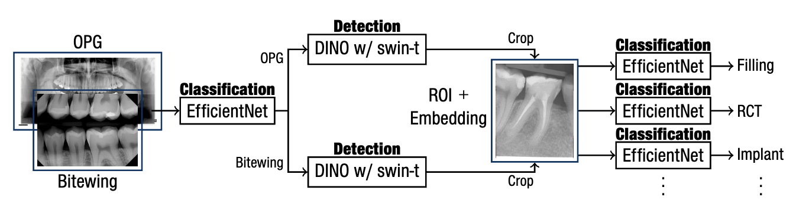

<!-- https://altai.insight-centre.org/AL/1804/ -->
<!-- _footer: ""-->
<!-- _paginate: skip -->
<!-- speaker_notes: In this presentation, we'll explore how our AI system for dental care adheres to the ALTAI principles for trustworthy AI. By following these principles, we ensure the development and deployment of reliable and responsible AI that benefits the dental field. -->

# Trustworthy AI
## AI:Dental AI system
- Data
- Algorithms
- Infrastructure
- Stakeholders

---
# 2D Dental X-ray image interpratation

---

<!-- # AI:Dental Examples of Trustworthiness -->

![bg](https://kroki.io/vega/svg/eNrlWVtP4zgUfudXWJmVgJ1e0kARizS7QuJhkVZapBlpHkY8OImbekntynZKA-p_X9u5OTe3pQzaBR5Gk2Ofq7_vHBuejwBwfuHBHC2gcwWcuRBLfjUer1AERxEW88QfYTrONmjpeDUd_cMpcQZK9RGHYi4Vp66rv-cIR3NhCJYwDDGJpOQiE8BEUI6fkPJGKEGZHYFFrETP8kN9orUy4lzfXt0gImAMrv_6dn0LGOJJLLjWUbZIMKdMbVzgMIxRIZ9RIr5mPiZeLgtT-TW8LL7WpTP5xXFEYKzsDHVC4zNHL23kvxsdX7aDyy0_9EqpSuBCp8JgiJMiMClPliEUeuU3tzJ2r43JFdhvSUC_zESKVzBOUOXYVNHrDyjVlQoCmshK-TjGIi3VKxNy09loWpMHMsKIMqXvlvLNwOrnz2QBCYARIkEKIAkBXSHG9aH3-PQOd_oNBXOCAwkDRv2EC4I41845nKG-bL3RWf3n8DjuGF7BPO8beYggUtkTCUPUHcP54akzSPgSMlXvn-XjBuszFOkASEYOQ8wDhheYQIEp0cnOIMOq6G9W6a80wEjxXnlHZIUZJYusEzyiOB76SDWVF9cj_9_9kRFKi4gyFIPQnCYs6CKoUCc0o2zRz1GRLrUmjCImW6hooCViNFn6aU2_LIYhue9LoOwsXHIEWboUJFESQ2YEn0e2pJhUDJbdjETI6JC1HvljeHc7AHe390Vs5Vka3d6teo0T0gXEpG4u74GNYqrejVEc5uUvHVjPSbVeGVkrp1hC1szVnpQ7AFkP70jrCTEqNwmWoFIm-5EyNpNTAbUzrQ7SrXKb9pya5DYNjekncY6YOZ_WfVFn08prR5z2aWQDeuyBz8BzG_Utp90CsocOFBWF1Xit6lqcQ041jAzWPGESIhX-pBTNGF3Uo5vBAImayAIQw2GmtxuVyj5g5VNVwHoJehmtMNYdXOFw2N7SqkAt4SwrY21TU26AxZDXQVMuYLWwpHF2HWkuG40zJ8wwiClHodPYWIuiA5UdWNPd6OQ44-fxAMgMk8VIuzsFv4KA8pN8S96Xyj2S-6en2yNID4yAY3JgBFww-rC9rpJyXCAU-0qyo9Hv-dXaYnkymm41NsNx_MrxKZN_L2GgLppWy-5o0jR21Pe12Xo1KDinHwednNN-h-11O-HqTH094m3lR4a0tWzFk3M7H16XFZm1tPBrYcFefvNHm9W1uidBcWJa14c2OB6dHe_gg9pg18zQsA9-l2B0J-APMAESl9sdQUkKsoU3QXb0W235kCONLbu5_A27nX7ydfu9eGfbDPo0Dp3XaBCfXP3jvITM1qt2QWmWmDfq-sVuGDEcOpbrQ8FjfV9v392KG0h5EeticieLOxhctbbePpG-RGnttbUqOGcX0z1HZiOq3RzsMxHrDnomYWPKRAym22x0D75q6FlxtrHirDYazIfeMIY-itsoq4NrY7vXHoKq6iRO8qP4DKanhx34Hl5efupFz68_2-p7ilZav5E_t8cH17_zg749ZdnK727BGHhOq5WVWGO6Ox5ZGt9zr26MZk1V881QS83o7DtmZ8lMzShLToIu98toF5dfvlh9do2knQvpUyEki3YsZTGGDP0YBg_OvhSvPbeqX6o-Sio23mJ7j5KdGW57cu3w3GqMBhuR3ZEn-fsa82EPL-98SHQjaEYT9j4RdP4mCDr_8AjieP0-AXTxJgC6-PAA0m--d4mgyzdB0OWHRxBN5JnuDCDz_f3fxVH58lh7eyGj1Eu9_8tZq78YHW3-Be8znU4=)

<!-- _footer: https://altai.insight-centre.org/-->

<!-- 
ALTAI seven principles
- Human Agency and Oversight
- Technical Robustness and Safety
- Privacy and Data Governance
- Transparency
- Diversity, Non-discrimination and Fairness
- Societal and Environmental Well-being
- Accountability
-->

---

## Human Agency and Oversight (3.25)

<!-- AI systems should support human autonomy and decision-making, as prescribed by the principle of respect for human autonomy. This requires that AI systems should both act as enablers to a democratic, flourishing and equitable society by supporting the user’s agency and upholding fundamental rights, which should be underpinned by human oversight. In this section, we are asking you to assess the AI system in terms of the respect for human agency, as well as human oversight. -->

- Dental professional is final decision maker (Human Oversight)
- Integrating AI into dental education (Human Autonomy)

<!-- Image: (Left side) Consider adding an image of dentists working ogether or a student learning dentistry.-->

---
## Technical Robustness and Safety (2.33)
<!-- A crucial requirement for achieving Trustworthy AI systems is their dependability (the ability to deliver services that can justifiably be trusted) and resilience (robustness when facing changes). Technical robustness requires that AI systems are developed with a preventative approach to risks and that they behave reliably and as intended while minimising unintentional and unexpected harm as well as preventing it where possible. This should also apply in the event of potential changes in their operating environment or the presence of other agents (human or artificial) that may interact with the AI system in an adversarial manner. The questions in this section address four main issues: 1) security; 2) safety; 3) accuracy; and 4) reliability, fall-back plans and reproducibility. -->
- Cooperation with Third-party cyber security (Security)
<!-- - TODO: Certified for cybersecurity (e.g., the certification scheme created by the Cybersecurity Act in Europe) -->
- Setting up QMS (Safety)
<!-- - TODO: Risks, risk metrics and risk levels -->
- Data-centric AI with continual data acquisition (Accuracy)
- Source code & Data versioning in place (Reproducibility)

<!-- Image: (Left side) Consider adding an image of a checkmark or shield to represent safety and security.-->

---

## Privacy and Data Governance (4)

<!-- Closely linked to the principle of prevention of harm is privacy, a fundamental right particularly affected by AI systems. Prevention of harm to privacy also necessitates adequate data governance that covers the quality and integrity of the data used, its relevance in light of the domain in which the AI systems will be deployed, its access protocols and the capability to process data in a manner that protects privacy. -->

- GDPR, Pseudonymisation, Data minimisation (Privacy)
- Data with explicit consent (Data Governance)

---

## Transparency (4)
<!-- A crucial component of achieving Trustworthy AI is transparency which encompasses three elements: 1) traceability, 2) explainability and 3) open communication about the limitations of the AI system. Technical robustness requires that AI systems be developed with a preventative approach to risks and in a manner such that they reliably behave as intended while minimising unintentional and unexpected harm, and preventing unacceptable harm. This should also apply to potential changes in their operating environment or the presence of other agents (human and artificial) that may interact with the system in an adversarial manner. In addition, the physical and mental integrity of humans should be ensured. -->

- Each model training is versionized in experiment logging to monitor the training and evaluation of a model (Traceability)
- Reasoning behind the decisions with text and visual explanations (Explainability)
- Materials about how data are used (Communication)

<!-- * **Example:** 
    - Transparent Dataset in Education platform -->

<!-- Image: (Left side) Consider adding an image of an open book or microscope to represent transparency. -->

---

## Diversity, Non-discrimination & Fairness (2.33)
<!-- In order to achieve Trustworthy AI, we must enable inclusion and diversity throughout the entire AI system’s life cycle. AI systems (both for training and operation) may suffer from the inclusion of inadvertent historic bias, incompleteness, and bad governance models. The continuation of such biases could lead to unintended (in)direct prejudice and discrimination against certain groups or people, potentially exacerbating prejudice and marginalisation. Harm can also result from the intentional exploitation of (consumer) biases or by engaging in unfair competition, such as the homogenisation of prices by means of collusion or a non- transparent market. Identifiable and discriminatory bias should be removed in the collection phase where possible. AI systems should be user-centric and designed in a way that allows all people to use AI products or services, regardless of their age, gender, abilities or characteristics. Accessibility to this technology for persons with disabilities, which are present in all societal groups, is of particular importance. -->

- International cooperation to ensure diverse and representative datasets (Avoidance of unfair bias)
- Annotating data with multiple opinions from various dental professionals (Subjectivity bias)
- Provide equal Access to educational resources and opportunities for dental students (Accessibility)
- Stakeholder matrix, interviews (User-centric)

<!-- Image: (Left side) Consider adding an image of a globe or people from diverse backgrounds to represent data diversity. -->

---
# Societal and Environmental Well-being (4)
<!-- In line with the principles of fairness and prevention of harm, the broader society, other sentient beings and the environment should be considered as stakeholders throughout the AI system's life cycle. Ubiquitous exposure to social AI systems in all areas of our lives (be it in education, work, care or entertainment) may alter our conception of social agency, or negatively impact our social relationships and attachment. While AI systems can be used to enhance social skills, they can equally contribute to their deterioration. This could equally affect peoples' physical and mental well-being. The effects of AI systems must therefore be carefully monitored and considered. Sustainability and ecological responsibility of AI systems should be encouraged, and research should be fostered into AI solutions addressing areas of global concern, for instance the Sustainable Development Goals. Overall, AI should be used to benefit all human beings, including future generations. AI systems should serve to maintain and foster democratic processes and respect the plurality of values and life choices of individuals. AI systems must not undermine democratic processes, human deliberation or democratic voting systems or pose a systemic threat to society at large. -->
- Do not require real-time inference to bring AI value to users(Environmental Wellbeing)
- Dental education improvements (Impact on work and skills)

---

## Accountability (3.5)
<!-- The principle of accountability necessitates that mechanisms be put in place to ensure responsibility for the development, deployment and/or use of AI systems. This topic is closely related to risk management, identifying and mitigating risks in a transparent way that can be explained to and audited by third parties. When unjust or adverse impacts occur, accessible mechanisms for accountability should be in place that ensure an adequate possibility of redress.  -->
- Data management and auditing system for the training data used in the AI model inplace (Auditability) [[DVC](https://dvc.org/), [MLOps](https://mlflow.org/)]
- Developing Software as a Medical Device which has to be Regulatory Compliant (Risk Management)[[Open regulatory](https://app.openregulatory.com/)]

<!-- Image: (Left side) Consider adding an image of a handshake or scales to represent accountability.-->

<!-- Speaker Notes:
While we strive for a trustworthy AI system, challenges exist. Maintaining high-quality and diverse data is an ongoing effort. We actively address ethical considerations and work to mitigate potential biases in data and models.  Continual improvement ensures our AI adapts to new information and remains reliable. Finally, meeting regulatory standards is crucial for operating in the healthcare field.
Developing trustworthy AI involves ongoing efforts.  We continuously strive to maintain high-quality and diverse datasets, adhere to ethical guidelines, and address potential biases.  Regular updates ensure our AI adapts to new information and remains reliable.  Finally, meeting regulatory standards is crucial for operating in the healthcare field. -->

---

![bg](https://kroki.io/vega/svg/eNrlWUtz2zYQvutXcNjO2G70oGQr42Ym7fTQgw-ZeJpDDhkfQBKiEEEEC4KKaI_-ewHwBfABUpbqaW0fMuYC-8J-3y7gPI0sy_459tZwC-wPlr1mLIo_zGY7GIBpgNg6caeIzLINUjrbLaffYxLaY6H6A_lszRWXjiO_1xAFa6YIIuD7KAy4ZJEJQMJIjB6h8BaSEGZ2GGJYiJ74h_iEe2HE_gRQaHlrgDEIAxjLvcJG6K0JFRu2yPcxLOQrErIvme35Ipf5Kf-a3BZf-9IJ_4pREAIs7ExkIrNrWy4d-L8HGVe2I-ZbvsmVUjUEW5kCBT5KisC4PIl8wOTKr05l7EEa4yug2xIDbpkJF-8ATmDlWFWR6xsoErO_JO536CG2QywtlSsDfMv1dKnJPR5fQKjQdkr5YWz08gn6yAPYEhlYwPs7QTFiKAdBw-PNyf4-7yClECNeaPhv-fgLxRtry9MIQHcq5zi8P-6sP_cR5lAGLsLddRrgKP_tYaS4bQCJu1UAGZOEem0AYxSE8YrQbTfGWBpJTRAElFOf1WoRUJJEbqrpl4krkoeuBEpmxBxc0MAyzv4EA6oEn0cWERSySkxFm1AYrnH82-T-bmzd3z0UsZV1U7qUUxXc9smWF003l3O4dpii9yCI_fz4SwfGOonWwSNr5IRRCNVczUk5YyvrQS1pPUJK-CZGE1jKQiTRsOJdDTYzrQrpVLktO6oGQ4_4SteGIYNU7a_7rqizbrtoRpx2aWSDZbaw3vFBUjvfsltvAd20oKg4WInX6lyLOuRUQ1BhzSMKfSjCn5eiFSVbPboV8CDTRAaAKA4zvWFUKvuAkU_VAepH0MlogbH24AqHk-aWxgloCWdZKWsHTbkGFkWug6ZcQGIhIjgbp_VlpXHmhJl4mMTQt2sbtShaUNmCNdmNLi8yfl6MxdRLtlPp7sr6xfJIfJlvyftSuYdz_-qqP4L0xAhiFJ4YQcwo2fSfK6dczCDErpAMNPo1vxIaLM-ny15jK4TxmeMTJj9HwBMj2GjZmc7rxkZdX4fea0DBOXmpbeWc9DtprpsJpzP1fMTr5UeGtD1vxfMbMx_Oy4rMWlr4NbDgKL_5Y8PoWtyTALtUrcuijS-m1xcDfBAT7OoZKvat3zgYnbn1uzW3OC77HQFOirCHN15W-l5bLoihxJbZXP4G66cff519Ld6HJoMuwb59jgbxkyN_7OeQ2XjVLihNE_VGrV_sJgFFvm24PhQ8lvf15t2tuIGUF7E2JreyuIXBVWvr7BPpc5T2i6ZWBefsYnrkyKxFNczBMRNRd9AxCWtTJqAg7bPRPviqoWfE2cGIM200qA-9CQYuxE2U6eA6mO61p6CqqsRlXop31vLqtIIf4eX5VS96vv5s0_cUrVS_kT81x0cs_1YFXHPKvJXf31kza2E3WlmJNSq748jQ-J46dTFc1VXVN4OWmtLZB2ZnyEzMKENOjETHZTTE5cePRp9tI2nwQbqEMc6igUdZjCFFHwNvYx9Lce25Vf1R8AenYu0tdvQoGcxw05NrwHOrNhpMRHamC87fc8yHI7y88iHRjqAVSejrRNDNiyDo5s0jKEb71wmg9y8CoPdvHkDyzfcqEXT7Igi6ffMIIgmv6WAAqe_v_y6OypfHfnEUMkq9dPF_qbX4H6PR4R-TUUk1)
<!-- Our AI system is built on the foundation of trustworthiness.  We prioritize a data-centric approach, ethical practices, and collaboration with dental professionals worldwide.  While challenges exist, we are committed to continuous improvement and transparency. This ensures our AI remains reliable and delivers effective outcomes in dental care. -->

---

![bg](https://kroki.io/vega/svg/eNrlWUtz2zYQvutXcNjO2G70oGQr42Ym7fTQgw-ZeJpDDhkfQBKiEEEEC4KKaI_-ewHwBfABUpbqaW0fMuYC-8J-3y7gPI0sy_459tZwC-wPlr1mLIo_zGY7GIBpgNg6caeIzLINUjrbLaffYxLaY6H6A_lszRWXjiO_1xAFa6YIIuD7KAy4ZJEJQMJIjB6h8BaSEGZ2GGJYiJ74h_iEe2HE_gRQaHlrgDEIAxjLvcJG6K0JFRu2yPcxLOQrErIvme35Ipf5Kf-a3BZf-9IJ_4pREAIs7ExkIrNrWy4d-L8HGVe2I-ZbvsmVUjUEW5kCBT5KisC4PIl8wOTKr05l7EEa4yug2xIDbpkJF-8ATmDlWFWR6xsoErO_JO536CG2QywtlSsDfMv1dKnJPR5fQKjQdkr5YWz08gn6yAPYEhlYwPs7QTFiKAdBw-PNyf4-7yClECNeaPhv-fgLxRtry9MIQHcq5zi8P-6sP_cR5lAGLsLddRrgKP_tYaS4bQCJu1UAGZOEem0AYxSE8YrQbTfGWBpJTRAElFOf1WoRUJJEbqrpl4krkoeuBEpmxBxc0MAyzv4EA6oEn0cWERSySkxFm1AYrnH82-T-bmzd3z0UsZV1U7qUUxXc9smWF003l3O4dpii9yCI_fz4SwfGOonWwSNr5IRRCNVczUk5YyvrQS1pPUJK-CZGE1jKQiTRsOJdDTYzrQrpVLktO6oGQ4_4SteGIYNU7a_7rqizbrtoRpx2aWSDZbaw3vFBUjvfsltvAd20oKg4WInX6lyLOuRUQ1BhzSMKfSjCn5eiFSVbPboV8CDTRAaAKA4zvWFUKvuAkU_VAepH0MlogbH24AqHk-aWxgloCWdZKWsHTbkGFkWug6ZcQGIhIjgbp_VlpXHmhJl4mMTQt2sbtShaUNmCNdmNLi8yfl6MxdRLtlPp7sr6xfJIfJlvyftSuYdz_-qqP4L0xAhiFJ4YQcwo2fSfK6dczCDErpAMNPo1vxIaLM-ny15jK4TxmeMTJj9HwBMj2GjZmc7rxkZdX4fea0DBOXmpbeWc9DtprpsJpzP1fMTr5UeGtD1vxfMbMx_Oy4rMWlr4NbDgKL_5Y8PoWtyTALtUrcuijS-m1xcDfBAT7OoZKvat3zgYnbn1uzW3OC77HQFOirCHN15W-l5bLoihxJbZXP4G66cff519Ld6HJoMuwb59jgbxkyN_7OeQ2XjVLihNE_VGrV_sJgFFvm24PhQ8lvf15t2tuIGUF7E2JreyuIXBVWvr7BPpc5T2i6ZWBefsYnrkyKxFNczBMRNRd9AxCWtTJqAg7bPRPviqoWfE2cGIM200qA-9CQYuxE2U6eA6mO61p6CqqsRlXop31vLqtIIf4eX5VS96vv5s0_cUrVS_kT81x0cs_1YFXHPKvJXf31kza2E3WlmJNSq748jQ-J46dTFc1VXVN4OWmtLZB2ZnyEzMKENOjETHZTTE5cePRp9tI2nwQbqEMc6igUdZjCFFHwNvYx9Lce25Vf1R8AenYu0tdvQoGcxw05NrwHOrNhpMRHamC87fc8yHI7y88iHRjqAVSejrRNDNiyDo5s0jKEb71wmg9y8CoPdvHkDyzfcqEXT7Igi6ffMIIgmv6WAAqe_v_y6OypfHfnEUMkq9dPF_qbX4H6PR4R-TUUk1)

![bg](https://kroki.io/vega/svg/eNrlWVtP4zgUfudXWJmVgJ1e0kARizS7QuJhkVZapBlpHkY8OImbekntynZKA-p_X9u5OTe3pQzaBR5Gk2Ofq7_vHBuejwBwfuHBHC2gcwWcuRBLfjUer1AERxEW88QfYTrONmjpeDUd_cMpcQZK9RGHYi4Vp66rv-cIR3NhCJYwDDGJpOQiE8BEUI6fkPJGKEGZHYFFrETP8kN9orUy4lzfXt0gImAMrv_6dn0LGOJJLLjWUbZIMKdMbVzgMIxRIZ9RIr5mPiZeLgtT-TW8LL7WpTP5xXFEYKzsDHVC4zNHL23kvxsdX7aDyy0_9EqpSuBCp8JgiJMiMClPliEUeuU3tzJ2r43JFdhvSUC_zESKVzBOUOXYVNHrDyjVlQoCmshK-TjGIi3VKxNy09loWpMHMsKIMqXvlvLNwOrnz2QBCYARIkEKIAkBXSHG9aH3-PQOd_oNBXOCAwkDRv2EC4I41845nKG-bL3RWf3n8DjuGF7BPO8beYggUtkTCUPUHcP54akzSPgSMlXvn-XjBuszFOkASEYOQ8wDhheYQIEp0cnOIMOq6G9W6a80wEjxXnlHZIUZJYusEzyiOB76SDWVF9cj_9_9kRFKi4gyFIPQnCYs6CKoUCc0o2zRz1GRLrUmjCImW6hooCViNFn6aU2_LIYhue9LoOwsXHIEWboUJFESQ2YEn0e2pJhUDJbdjETI6JC1HvljeHc7AHe390Vs5Vka3d6teo0T0gXEpG4u74GNYqrejVEc5uUvHVjPSbVeGVkrp1hC1szVnpQ7AFkP70jrCTEqNwmWoFIm-5EyNpNTAbUzrQ7SrXKb9pya5DYNjekncY6YOZ_WfVFn08prR5z2aWQDeuyBz8BzG_Utp90CsocOFBWF1Xit6lqcQ041jAzWPGESIhX-pBTNGF3Uo5vBAImayAIQw2GmtxuVyj5g5VNVwHoJehmtMNYdXOFw2N7SqkAt4SwrY21TU26AxZDXQVMuYLWwpHF2HWkuG40zJ8wwiClHodPYWIuiA5UdWNPd6OQ44-fxAMgMk8VIuzsFv4KA8pN8S96Xyj2S-6en2yNID4yAY3JgBFww-rC9rpJyXCAU-0qyo9Hv-dXaYnkymm41NsNx_MrxKZN_L2GgLppWy-5o0jR21Pe12Xo1KDinHwednNN-h-11O-HqTH094m3lR4a0tWzFk3M7H16XFZm1tPBrYcFefvNHm9W1uidBcWJa14c2OB6dHe_gg9pg18zQsA9-l2B0J-APMAESl9sdQUkKsoU3QXb0W235kCONLbu5_A27nX7ydfu9eGfbDPo0Dp3XaBCfXP3jvITM1qt2QWmWmDfq-sVuGDEcOpbrQ8FjfV9v392KG0h5EeticieLOxhctbbePpG-RGnttbUqOGcX0z1HZiOq3RzsMxHrDnomYWPKRAym22x0D75q6FlxtrHirDYazIfeMIY-itsoq4NrY7vXHoKq6iRO8qP4DKanhx34Hl5efupFz68_2-p7ilZav5E_t8cH17_zg749ZdnK727BGHhOq5WVWGO6Ox5ZGt9zr26MZk1V881QS83o7DtmZ8lMzShLToIu98toF5dfvlh9do2knQvpUyEki3YsZTGGDP0YBg_OvhSvPbeqX6o-Sio23mJ7j5KdGW57cu3w3GqMBhuR3ZEn-fsa82EPL-98SHQjaEYT9j4RdP4mCDr_8AjieP0-AXTxJgC6-PAA0m--d4mgyzdB0OWHRxBN5JnuDCDz_f3fxVH58lh7eyGj1Eu9_8tZq78YHW3-Be8znU4=)
