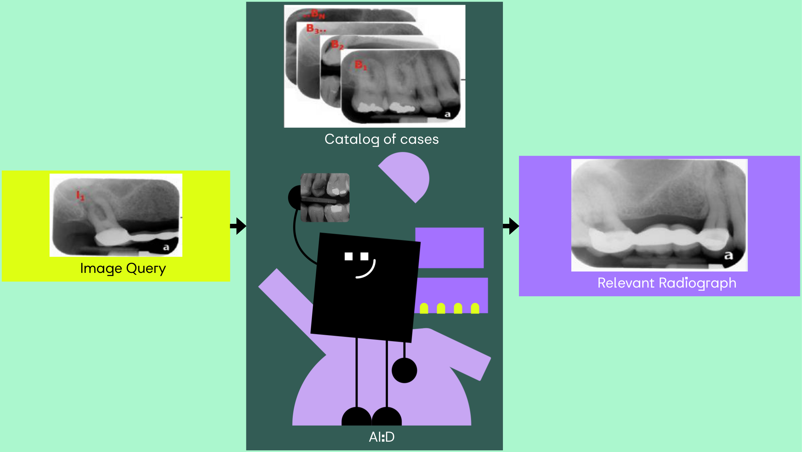

<!-- Add this anywhere in your Markdown file -->

<!--  -->
<!--
HD 1280 x 720	13.333	7.5
Full HD 1920 x 1080	19.999	11.25
Quad HD 3840 x 2160	39.999	22.50
4K 4096 x 2160	42.664	22.50 
-->

<!-- https://docs.decksetapp.com/English.lproj/Formatting/13-auto-scaling.html -->

<!-- _paginate: skip -->
<!-- _footer: "" -->
# Bridging the Gap
## How AI Connects Dental Clinics with Students

AI:Dental

---
<!-- _backgroundColor: '#A478FF' -->
<!-- _color: '#000' -->
# Brief Intro

Peter Jurkáček
CTO at AI:Dental

peter.jurkacek@aidental.ai

<!-- 
# Problem statement
- Studenti idu na kliniku nepripraveni
- Proces pridelovania stundetov na kliniky nie je transparentny
- Challanges in dental education
    - Curricular Relevance (Stream data from real clinics automatically)
    - Clinical Training Opportunities (Transform data to training materials)
    - Ethical and Legal Challenges (Consents)
    - Access to Education (Free)
- Students' and Professor's pain points
- Relatable story 
-->

<!-- References
https://www.ncbi.nlm.nih.gov/pmc/articles/PMC8238744/
https://pubmed.ncbi.nlm.nih.gov/30861309/ 
https://www.ncbi.nlm.nih.gov/pmc/articles/PMC9026102/
https://www.ncbi.nlm.nih.gov/pmc/articles/PMC5334326/
https://www.researchgate.net/publication/

(1996 Room for improvement? The accuracy of dental practitioners who diagnose bony pathoses with radiographs)[https://pubmed.ncbi.nlm.nih.gov/8665324/]
-->
---
# Bridging <u>the Gap</u>
## How AI Connects Dental Clinics with Students

<!-- ---
To democratize dental health through AI by enhancing precision, affordability, and accessibility in education and patient care. 
Shaping the future of the dentistry through creating the conditions for everyone to access the affordable and personalised healthcare.  -->

---
<!-- _footer: "1. 2022 Evaluation of radiographic interpretation skills of undergraduate dental students studying in a dental college of Punjab, India – A comparative study" -->
# The Gap
Dental students' accuracy ranges from **48% - 65%** in radiograph interpretation[1]

<!-- Which is problematic becuase Dental  radiographs  are  essential in  making  an accurate diagnosis, performing dental procedures, in evaluating procedural success and in documentation of dental and oral health -->

[1]: https://www.researchgate.net/publication/367683626_Evaluation_of_radiographic_interpretation_skills_of_undergraduate_dental_students_studying_in_a_dental_college_of_Punjab_India_-_A_comparative_study

<!-- 

 
-->
<!-- *Expert 1*, *Expert 2* -->

<!-- interpreting radiographs (i.e., orthopantomograms, OPTs) is an error-prone process, even in experts -->
<!-- low-prevalence anomalies earlier and high-prevalence anomalies -->
---
<!-- _footer: "2. 2022 Dental Students’ Knowledge, Confidence, Ability, and Self-Reported Difficulties in Periodontal Education: A Mixed Method Pilot Study" -->
# Why the Gap?[2]

- Limited or no access to relevant radiographs (X-rays)
- Instructor inconsistency

[2]: https://www.ncbi.nlm.nih.gov/pmc/articles/PMC9026102/

---
# <u>Bridging</u> the Gap
## How AI Connects Dental Clinics with Students

---

## The Bridge - AI:Dental for Education

- A) Auto-transform radiographs into assignments (train, test, evaluate).

- B) Apply supervised learning with visual explanations

- C) Search for relevant radiographs (Google Lens for dentistry).

---
## A) Auto-transform radiographs into assignments
#

Digital Medical Record

    <!--  -->

Questions & Answers

---
<!-- _footer: "3. An Explainable Deep Learning Model to Prediction Dental Caries Using Panoramic Radiograph Images (2023)" -->
## B) Apply supervised learning with visual explanations
#

Questions & Answers

Saliency maps[3]

[3]: https://www.researchgate.net/publication/366946851_An_Explainable_Deep_Learning_Model_to_Prediction_Dental_Caries_Using_Panoramic_Radiograph_Images

---
<!-- _footer: "4. Dental CLAIRES: Contrastive LAnguage Image REtrieval Search for Dental Research (2023)" -->

<!-- 
https://www.sciencedirect.com/science/article/pii/S2772442523001491 
https://www.mdpi.com/2075-5309/13/2/275
https://www.ncbi.nlm.nih.gov/pmc/articles/PMC10283104/
-->
## C) Search for relevant radiographs[4]

<!--  -->

[4]: https://www.ncbi.nlm.nih.gov/pmc/articles/PMC10283104/

---
# Advantages for Dental Clinics
- Performance evaluation
- Onboarding zamestnancov
- Ušetrený čas a peniaze
- save 5 minutes per visit with assisted diagnostics
- Patient treatment outcomes
- Better dental care

---
# Future Developments / Next steps

### Spoluprace s univerzitami po celom svete
### Case studies
- Meduni & LFUK & Bangalore
- Subjectivity of a dentists
- AI reader study
### CE mark
- Spadame pod MDR preto potrebujeme CE mark
- clinical investigation
---