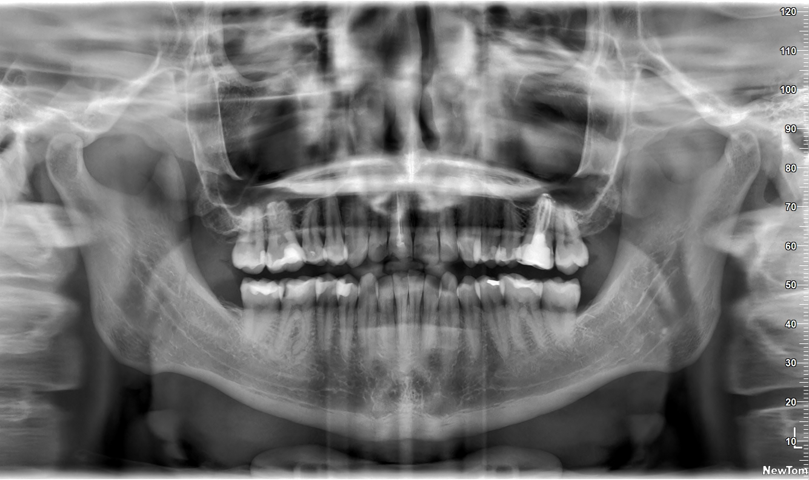
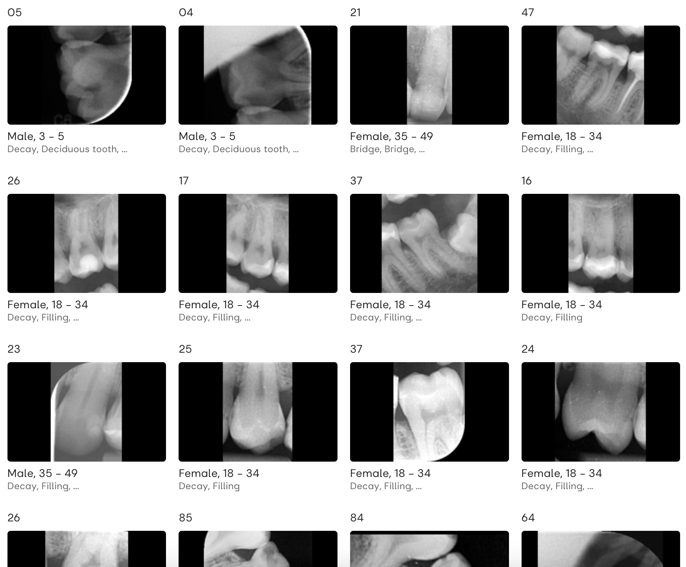

<!-- Add this anywhere in your Markdown file -->

<!--  -->
<!--
HD 1280 x 720	13.333	7.5
Full HD 1920 x 1080	19.999	11.25
Quad HD 3840 x 2160	39.999	22.50
4K 4096 x 2160	42.664	22.50 
-->

<!-- https://docs.decksetapp.com/English.lproj/Formatting/13-auto-scaling.html -->

<!-- _paginate: skip -->
<!-- _footer: "" -->
# Bridging the Gap
## How AI Connects Dental Clinics with Students

AI:Dental

---
<!-- _color: '#000' -->
# Brief Intro

Peter Jurkáček
CTO at AI:Dental

peter.jurkacek@aidental.ai

<!-- 
# Problem statement
- Studenti idu na kliniku nepripraveni
- Proces pridelovania stundetov na kliniky nie je transparentny
- Challanges in dental education
    - Curricular Relevance (Stream data from real clinics automatically)
    - Clinical Training Opportunities (Transform data to training materials)
    - Ethical and Legal Challenges (Consents)
    - Access to Education (Free)
- Students' and Professor's pain points
- Relatable story 
-->

<!-- References
https://www.ncbi.nlm.nih.gov/pmc/articles/PMC8238744/
https://pubmed.ncbi.nlm.nih.gov/30861309/ 
https://www.ncbi.nlm.nih.gov/pmc/articles/PMC9026102/
https://www.ncbi.nlm.nih.gov/pmc/articles/PMC5334326/
https://www.researchgate.net/publication/

(1996 Room for improvement? The accuracy of dental practitioners who diagnose bony pathoses with radiographs)[https://pubmed.ncbi.nlm.nih.gov/8665324/]
-->
---
# Bridging <u>the Gap</u>
## How AI Connects Dental Clinics with Students

<!-- ---
To democratize dental health through AI by enhancing precision, affordability, and accessibility in education and patient care. 
Shaping the future of the dentistry through creating the conditions for everyone to access the affordable and personalised healthcare.  -->

---
<!-- _footer: "1. 2022 Evaluation of radiographic interpretation skills of undergraduate dental students studying in a dental college of Punjab, India – A comparative study" -->

<h1>The Gap</h1>

Dental students' accuracy ranges from **48% - 65%** in X-Ray interpretation

X-Rays interpretation[1]

[1]: https://www.researchgate.net/publication/367683626_Evaluation_of_radiographic_interpretation_skills_of_undergraduate_dental_students_studying_in_a_dental_college_of_Punjab_India_-_A_comparative_study
---
<!-- _footer: "2. 2022 Dental Students’ Knowledge, Confidence, Ability, and Self-Reported Difficulties in Periodontal Education: A Mixed Method Pilot Study" -->
# Why the Gap?[2]

- Limited or no access to relevant X-Rays
- Challenges in obtaining real-time supervision feedback

[2]: https://www.ncbi.nlm.nih.gov/pmc/articles/PMC9026102/

---
# <u>Bridging</u> the Gap
## How AI Connects Dental Clinics with Students

---
# Bridging the Gap

AI:Dental Education platform & AI

---

# AI:Dental Education platform & AI

:A Convert X-Rays to educational content
:B Real-time supervised learning
:C Search for relevant X-Rays

---
## :A Convert X-Rays to educational content

Digital Medical Record

    <!--  -->

Questions & Answers

---
<!-- _footer: "3. An Explainable Deep Learning Model to Prediction Dental Caries Using Panoramic Radiograph Images (2023)" -->
## :B Real-time supervised learning

Questions & Answers

Solution explanation[3]

[3]: https://www.researchgate.net/publication/366946851_An_Explainable_Deep_Learning_Model_to_Prediction_Dental_Caries_Using_Panoramic_X-Ray_Images

---
<!-- _footer: "4. Dental CLAIRES: Contrastive LAnguage Image REtrieval Search for Dental Research (2023)" -->

<!-- 
https://www.sciencedirect.com/science/article/pii/S2772442523001491 
https://www.mdpi.com/2075-5309/13/2/275
https://www.ncbi.nlm.nih.gov/pmc/articles/PMC10283104/
-->
## :C Search for relevant X-Rays

Catalog of cases

Relevant X-Ray[4]

[4]: https://www.ncbi.nlm.nih.gov/pmc/articles/PMC10283104/
---
# Better dental care :D

- Performance evaluation
- Employee onboarding
- Saved time & money
- Patient treatment outcomes

--- 

<h1>Let's collaborate :D</h1>

- Universities
- Dental clinics
- Hospital
- Case Studies

## AI:Dental

